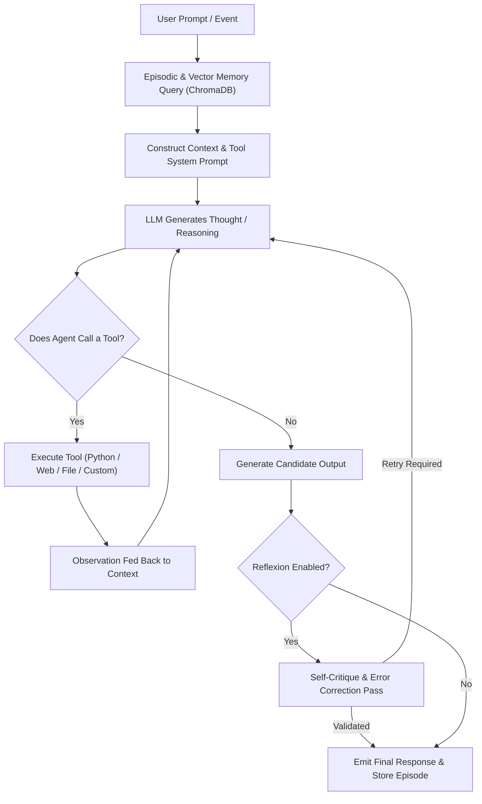

# OpenClaw Autonomous Agents SDK

The **OpenClaw Agents SDK** (`agents/`) provides a production-grade autonomous agent framework integrating **ReAct reasoning loops**, **episodic & semantic vector memory (ChromaDB)**, **self-critique (Reflexion pattern)**, and **dynamic tool invocation**.

---

## 🐝 Agent Architectural Blueprint



---

## ⚡ Core SDK Features

### 1. ReAct Reasoning Loop with Tool Execution
Agents iteratively think, select tools, observe execution results, and reason toward the solution:

```python
import asyncio
from agents.framework.client import AgentClient

async def main():
    client = AgentClient(use_swarm=False)
    
    # Register tools dynamically
    client.add_tool("web_search")
    client.add_tool("python_execute")
    client.add_tool("file_read")
    client.add_tool("file_write")
    
    response = await client.run(
        user_id="analyst_1",
        prompt="Search for the latest Flash Attention 3 benchmarks, analyze them in Python, and save a summary chart to flash_bench.png"
    )
    print(response.content)

if __name__ == "__main__":
    asyncio.run(main())
```

### 2. Episodic & Long-Term Vector Memory (ChromaDB)
Agents retain conversational context across sessions by retrieving semantic embeddings of past interactions without blowing up context token limits.

```python
client = AgentClient(use_vector_memory=True)
# Context from previous sessions is automatically retrieved and prepended
```

### 3. Self-Critique & Error Recovery (Reflexion)
When `use_reflexion=True`, the agent evaluates its own output before emitting it. If the response contains invalid Python code, unverified claims, or syntax errors, it initiates a targeted correction loop.
