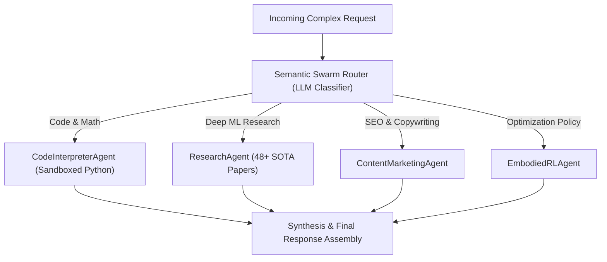

# Swarm Intelligence & Multi-Agent Orchestration

TruthGPT integrates two multi-agent collaboration paradigms (`agents/orchestration/` and `agents/domains/`): **Dynamic Semantic Swarms** and **Deterministic Directed Acyclic Graph (DAG) Workflows**.

---

## 🐝 1. Dynamic Semantic Swarm Router

The Swarm Orchestrator dynamically classifies incoming tasks and delegates execution to the most qualified specialized agent (e.g. Research, Code Interpreter, Marketing, RL Policy):



### Python API Example:
```python
from agents.framework.client import AgentClient

async def run_swarm():
    client = AgentClient(use_swarm=True, max_handoff_depth=5)
    
    # Automatically routed to ResearchAgent and CodeInterpreterAgent
    result = await client.run(
        user_id="lead_dev",
        prompt="Synthesize the key findings of the LongRoPE paper and write an implementation in PyTorch."
    )
    print(f"Handled by: {result.agent_name}")
    print(result.content)
```

---

## 🌲 2. Deterministic Graph Workflows (`GraphOrchestrator`)

For multi-step deterministic pipelines requiring strict validation gates:

```python
from agents.orchestration.graph_orchestrator import GraphOrchestrator

# Initialize DAG
graph = GraphOrchestrator()

# Add agent nodes
graph.add_node("Scraper", web_scraper_agent)
graph.add_node("Analyzer", data_analyzer_agent)
graph.add_node("Reporter", report_writer_agent)

# Define execution edges & conditionals
graph.add_edge("Scraper", "Analyzer")
graph.add_edge("Analyzer", "Reporter")
graph.set_entry_point("Scraper")

# Execute DAG
result = await graph.run("analyst_1", "Scrape Q3 GPU pricing data and build an executive summary.")
```
