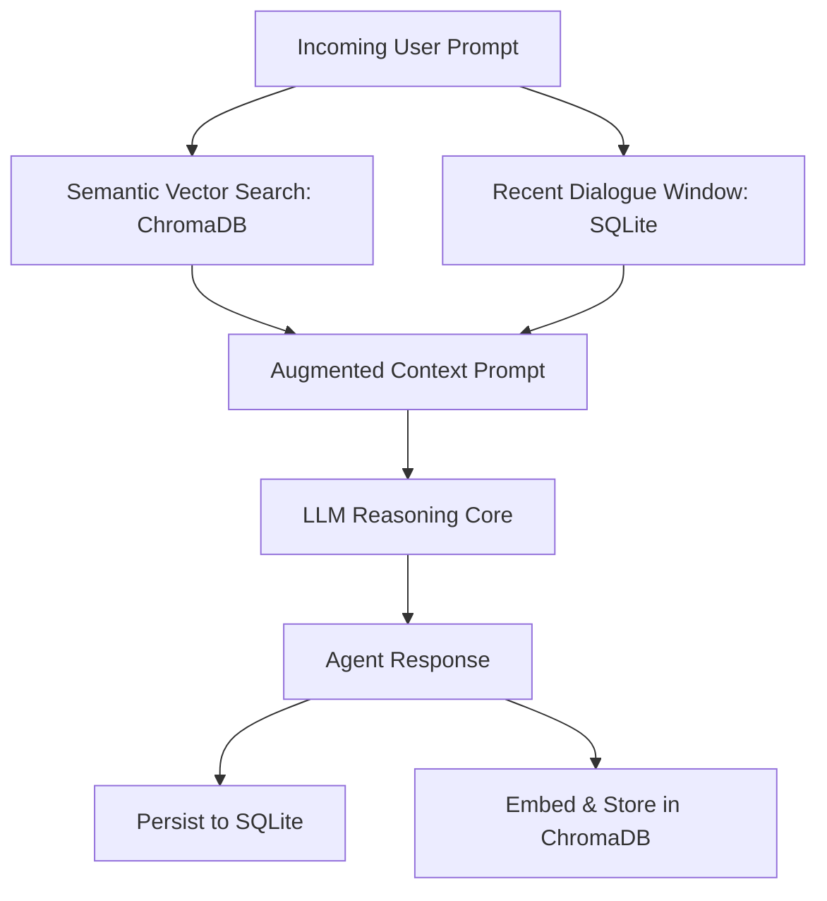

# Vector Memory, Episodic Storage & Tools SDK

The **OpenClaw Agent Subsystem** provides persistent dual-tier memory (SQLite for episodic dialogue history, ChromaDB for semantic vector retrieval) and an extensible Tool Calling SDK.

---

## 🧠 Dual-Tier Memory System



### 1. Episodic Dialogue Memory (SQLite)
- Stores chronological message turns, raw tool calls, execution outputs, and token counts.
- Memory is isolated per `user_id`.

```python
# Clear user conversation context
await client.clear_memory("user_1")
```

### 2. Semantic Long-Term Vector Memory (ChromaDB)
- Automatically embeds key facts, user preferences, and code snippets into a persistent ChromaDB collection.
- Queries relevant past episodes and injects them as dynamic RAG context without overflowing the context window.

---

## 🛠️ OpenClaw Tools SDK

### Built-In Tools

| Tool Identifier | Description | Safety Sandbox |
| :--- | :--- | :--- |
| `python_execute` | Sandboxed Python code evaluation (NumPy, PyTorch, Pandas). | Subprocess jail / Timeout limits |
| `web_search` | Real-time web retrieval via DuckDuckGo / Tavily API. | Read-only |
| `file_read` / `file_write` | Scoped file reading and writing in project scratch directory. | Path isolation |
| `delegate_task` | Hierarchical delegation to spawn sub-agents. | Max depth bounds |

---

## 💻 Registering Custom Tools

```python
from openclaw import AgentClient, tool

@tool(name="fetch_gpu_stats", description="Returns current GPU VRAM utilization and temperature.")
def fetch_gpu_stats() -> dict:
    import torch
    return {
        "device": torch.cuda.get_device_name(0),
        "vram_allocated_gb": torch.cuda.memory_allocated(0) / 1e9,
        "vram_reserved_gb": torch.cuda.memory_reserved(0) / 1e9
    }

# Register tool with client
client = AgentClient()
client.register_tool(fetch_gpu_stats)
```
