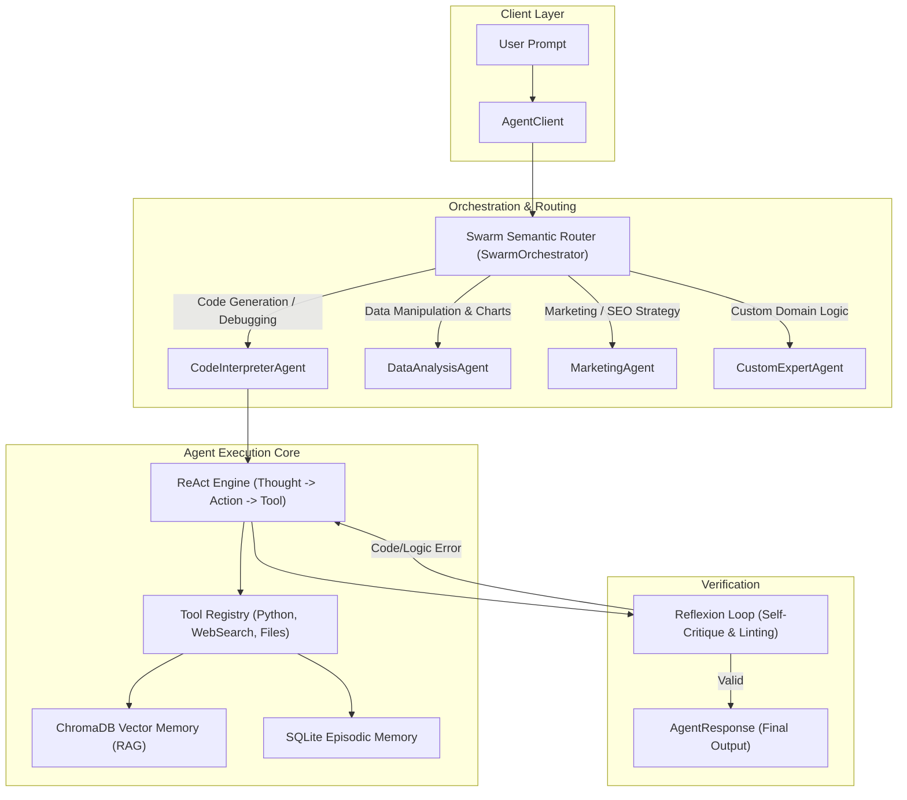

# 🤖 OpenClaw Agents SDK & API Reference

The **OpenClaw Agents SDK** (`optimization_core.agents`) provides an enterprise-ready framework for creating, managing, orchestrating, and deploying autonomous ReAct agents, multi-agent swarms, DAG state machines, smart schedulers with circuit breakers, vector memory, and multi-channel messaging webhooks.

---

## 🏛️ Agent Architecture Overview



---

## 🤖 `AgentClient`

**Location**: `agents.framework.interfaces.client.client` (aliased as `agents.AgentClient`)

```python
from agents import AgentClient, AgentConfig
```

### Initialization & Configuration
```python
import asyncio
from agents import AgentClient, AgentConfig

async def main():
    # 1. Configure the Agent Client
    config = AgentConfig(
        use_swarm=True,              # Automatically route queries to expert agents
        use_reflexion=True,          # Enable automatic self-critique & error correction
        use_vector_memory=True,      # Inject long-term context from Vector Memory
        max_handoff_depth=6,         # Limit sequential agent-to-agent delegations
        default_agent_name="ResearchAgent",
        llm_model="gpt-4o"
    )

    client = AgentClient(config=config)

    # 2. Add custom tools dynamically
    client.add_tool("web_search")
    client.add_tool("python_execute")
    client.add_tool("file_read")
    client.add_tool("file_write")

    # 3. Execute instruction
    response = await client.run(
        user_id="user_101",
        prompt="Analyze the efficiency of FlashAttention-2 and generate a markdown summary.",
        return_response=True
    )

    print(f"Agent Name: {response.agent_name}")
    print(f"Content:\n{response.content}")

if __name__ == "__main__":
    asyncio.run(main())
```

### Core Client Methods
- **`run(user_id: str, prompt: str, return_response: bool = False)`**: Executes task with semantic swarm delegation.
- **`add_tool(tool_name_or_instance: Union[str, BaseTool])`**: Dynamically registers a tool.
- **`clear_memory(user_id: str)`**: Purges episodic conversation history and cached vectors for the user.
- **`store_fact(user_id: str, fact: str)`**: Stores permanent semantic knowledge into vector memory.

---

## 🐝 `SwarmOrchestrator`

**Location**: `agents.orchestration.swarm.swarm_orchestrator`

```python
from agents.orchestration.swarm.swarm_orchestrator import SwarmOrchestrator
```

Manages dynamic semantic handoffs between specialized agents:
- `ResearchAgent`: Deep literature, web search, and knowledge synthesis.
- `CodeInterpreterAgent`: Sandboxed code generation, execution, and self-debugging.
- `DataAnalysisAgent`: Data frames, statistical tests, and chart generation.
- `MarketingAgent`: SEO optimization, copywriting, and campaign planning.

---

## 🕸️ `GraphOrchestrator` (Deterministic DAGs)

**Location**: `agents.orchestration.swarm.graph_orchestrator`

For state-machine pipelines where tasks must flow sequentially through fixed nodes:

```python
from agents.orchestration.swarm.graph_orchestrator import GraphOrchestrator

graph = GraphOrchestrator()

# Define pipeline nodes
graph.add_node("Scraper", scraper_agent)
graph.add_node("DataCleaner", cleaner_agent)
graph.add_node("ReportWriter", writer_agent)

# Define transitions
graph.add_edge("Scraper", "DataCleaner")
graph.add_edge("DataCleaner", "ReportWriter")
graph.set_entry_point("Scraper")

# Execute graph workflow
final_result = await graph.run(
    user_id="researcher_1",
    initial_input="Fetch latest PyTorch release notes and generate executive summary."
)
```

---

## ⏰ `SmartAgentScheduler` & Circuit Breaker

**Location**: `agents.orchestration.scheduler.smart_scheduler`

```python
from agents.orchestration.scheduler.smart_scheduler import (
    SmartAgentScheduler,
    AdaptiveTimeoutStrategy,
    CircuitBreaker
)

scheduler = SmartAgentScheduler()
scheduler.submit_task(
    task_id="daily_gpu_audit",
    agent_type="system_agent",
    coro=audit_coro(),
    priority=1
)
```

---

## 🌐 Webhook Integrations & Messaging Adapters

```bash
# Launch multi-platform webhook server
python -m agents.domains.messaging.whatsapp_webhook
```

### Supported Webhook Platforms

| Platform | Module Path | Environment Variables | Description |
| :--- | :--- | :--- | :--- |
| **Telegram** | `agents.domains.messaging.telegram_bot` | `TELEGRAM_BOT_TOKEN` | Bidirectional chat bot via Telegram API |
| **Discord** | `agents.domains.messaging.discord_bot` | `DISCORD_BOT_TOKEN` | Discord interactions and guild events |
| **Slack** | `agents.domains.messaging.slack_bot` | `SLACK_BOT_TOKEN` | Slack Bot API & channel listeners |
| **WhatsApp** | `agents.domains.messaging.whatsapp_webhook` | `TWILIO_AUTH_TOKEN` | WhatsApp webhook integration |
| **MS Teams** | `agents.domains.messaging.teams_adapter` | `TEAMS_APP_ID` | Azure Bot Service adapter |

---

## 📊 Observability & Distributed Tracing

OpenClaw features built-in OpenTelemetry-compatible tracing:

```python
from agents.framework.models import TelemetryEvent, AgentStepTrace

# Record telemetry event
event = TelemetryEvent(
    event_type="agent_step",
    agent_id="research_01",
    duration_ms=45.2,
    success=True
)
```

---

## 📡 REST API Endpoints

| Endpoint | Method | Description |
| :--- | :--- | :--- |
| `/v1/agent/run` | POST | Execute ReAct agent query with tools |
| `/v1/swarm/ask` | POST | Route query via semantic swarm router |
| `/v1/agent/memory/{user_id}` | DELETE | Wipe user memory session |
| `/v1/traces/recent` | GET | List recent execution spans and latency |
| `/v1/scheduler/tasks` | GET / POST | Manage recurring scheduler jobs |
| `/v1/webhooks/telegram` | POST | Inbound webhook handler for Telegram |
| `/v1/webhooks/discord` | POST | Inbound webhook handler for Discord |
| `/v1/webhooks/slack` | POST | Inbound webhook handler for Slack |
