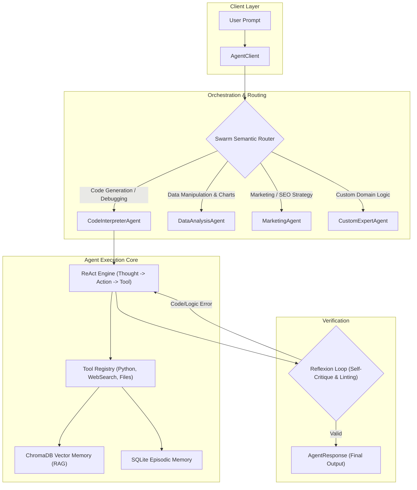

# OpenClaw Multi-Agent SDK API Reference

The **OpenClaw Agents SDK** provides an enterprise-ready framework for creating, orchestrating, and deploying autonomous agents with ReAct reasoning, ChromaDB vector memory, multi-turn self-reflection (Reflexion), and multi-platform webhook integrations.

---

## 🏛️ Agent Architecture Overview



---

## 🤖 `AgentClient`

**Location**: `agents.framework.client`

```python
import asyncio
from agents import AgentClient, AgentConfig

async def main():
    # 1. Configure the Agent Client
    config = AgentConfig(
        use_swarm=True,              # Automatically route queries to expert agents
        use_reflexion=True,          # Enable automatic self-critique & error correction
        use_vector_memory=True,      # Inject long-term context from ChromaDB
        max_handoff_depth=6,         # Limit sequential agent-to-agent delegations
        default_agent_name="ResearchAgent"
    )

    client = AgentClient(config=config)

    # 2. Add custom tools dynamically
    client.add_tool("web_search")
    client.add_tool("python_execute")
    client.add_tool("file_read")
    client.add_tool("file_write")

    # 3. Execute instruction
    response = await client.run(
        user_id="user_101",
        prompt="Analyze the efficiency of FlashAttention-2 and generate a markdown summary.",
        return_response=True
    )

    print(f"Agent Name: {response.agent_name}")
    print(f"Content:\n{response.content}")

if __name__ == "__main__":
    asyncio.run(main())
```

---

## 🧠 Advanced Memory Management

Every `AgentClient` maintains both short-term episodic state (SQLite) and semantic long-term embeddings (ChromaDB):

```python
# Clear episodic conversation history for a specific user
await client.clear_memory("user_101")

# Store permanent semantic fact in ChromaDB
await client.store_fact(
    user_id="user_101",
    fact="Project target deployment is NVIDIA H100 with CUDA 12.4 and FP8 precision."
)
```

---

## 🛠️ Graph-Based Multi-Agent Workflows (`GraphOrchestrator`)

For deterministic state-machine pipelines where tasks must flow sequentially through fixed nodes:

```python
from agents.orchestration.graph_orchestrator import GraphOrchestrator

graph = GraphOrchestrator()

# Define pipeline nodes
graph.add_node("Scraper", scraper_agent)
graph.add_node("DataCleaner", cleaner_agent)
graph.add_node("ReportWriter", writer_agent)

# Define transitions
graph.add_edge("Scraper", "DataCleaner")
graph.add_edge("DataCleaner", "ReportWriter")
graph.set_entry_point("Scraper")

# Execute graph workflow
final_result = await graph.run(
    user_id="researcher_1",
    initial_input="Fetch latest PyTorch 2.4 release notes and generate executive summary."
)
```

---

## 🌐 Webhook Integrations & Messaging Adapters

OpenClaw connects directly to communication platforms:

```bash
# Launch webhook server
openclaw serve --port 8080 --webhooks telegram,discord,slack
```

### Supported Webhook Platforms

| Platform | Required Environment Variables | Setup Instructions |
| :--- | :--- | :--- |
| **Telegram** | `TELEGRAM_BOT_TOKEN` | Create via `@BotFather`. Point webhook to `/webhooks/telegram`. |
| **Discord** | `DISCORD_BOT_TOKEN`, `DISCORD_APP_ID` | Register interactions URL in Discord Developer Portal. |
| **Slack** | `SLACK_BOT_TOKEN`, `SLACK_SIGNING_SECRET` | Subscribe to `message.channels` in Slack API dashboard. |
| **WhatsApp** | `TWILIO_ACCOUNT_SID`, `TWILIO_AUTH_TOKEN` | Configure Twilio Sandbox webhook to POST to `/webhooks/whatsapp`. |
| **MS Teams** | `TEAMS_APP_ID`, `TEAMS_APP_PASSWORD` | Configure Azure Bot Service messaging endpoint. |

---

## 📊 Observability & Distributed Tracing

OpenClaw features built-in OpenTelemetry-compatible distributed tracing:

```python
from agents.orchestration.observability import global_tracer

# Start parent trace span
trace_id = global_tracer.start_trace("user_query_pipeline", agent_name="SwarmRouter")

# Record nested tool execution span
span = global_tracer.start_span(trace_id, "python_execute", kind="tool_call")
# ... execute tool ...
span.finish(output="Script executed with returncode 0")
```

Access trace visualizations at `http://localhost:8080/v1/traces/recent`.
