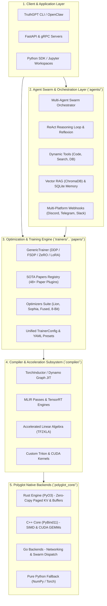
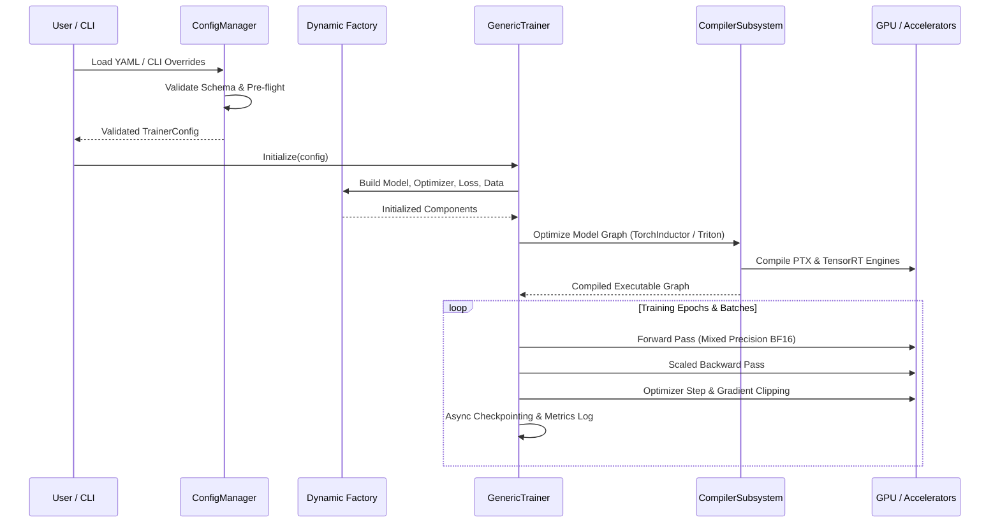

# 🏗️ TruthGPT Optimization Core Architecture

> [!NOTE]
> TruthGPT Optimization Core is engineered as a **modular, stratified, registry-based foundation framework**. It decouples component definitions from runtime orchestration, providing extreme extensibility and hardware acceleration across both training and serving workloads.

---

## 🏛️ Stratified Multi-Layer Architecture

The system is organized into five tightly integrated layers:



---

## 🧩 1. The Dynamic Registry System

Modularity is achieved via the **Registry Pattern**. Subsystems discover classes dynamically through string identifiers, allowing configuration via YAML without code alterations.

```python
# 1. Component Registration (e.g. in optimization_core/optimizers/pytorch/lion.py)
from factories.registry import OPTIMIZERS

@OPTIMIZERS.register("lion")
class LionOptimizer(torch.optim.Optimizer):
    def __init__(self, params, lr=1e-4, ...):
        ...

# 2. Declarative Specification (in config.yaml)
# optimizer:
#   type: lion
#   lr: 0.0001

# 3. Dynamic Factory Instantiation (in trainers/trainer.py)
self.optimizer = OPTIMIZERS.build(cfg.optimizer.type, model.parameters(), lr=cfg.optimizer.lr)
```

---

## 🔄 2. Complete Execution Lifecycle

Understanding the end-to-end training and inference lifecycle:



---

## 🌐 3. Polyglot Multi-Language Interoperability

TruthGPT pairs Python's rapid prototyping with low-level systems languages:

| Language | Integration Technology | Core Responsibilities |
| :--- | :--- | :--- |
| **Python** | Host Language | User APIs, high-level training loops, agent orchestration, PyTorch model definitions. |
| **Rust** | PyO3 / C-FFI | Thread-safe Paged KV-Cache allocation, zero-copy buffer pooling, tokenization. |
| **C++** | PyBind11 / CUDA C++ | Custom CUDA GEMM kernels, FlashAttention wrappers, SIMD AVX-512 tensor math. |
| **Go** | C-Shared / gRPC | High-concurrency network proxies, swarm message brokers, microservice dispatch. |

---

## 📚 Related Documentation Links
- [API Reference: Compiler Subsystem](api/compiler.md)
- [API Reference: Polyglot Core](api/polyglot_core.md)
- [API Reference: Generic Trainer](api/trainer.md)
- [API Reference: OpenClaw Agents SDK](api/openclaw_agents.md)
- [Engineering Guide: Distributed Training](guides/distributed_training.md)
- [Engineering Guide: KV-Cache Optimization](guides/kv_cache_optimization.md)
