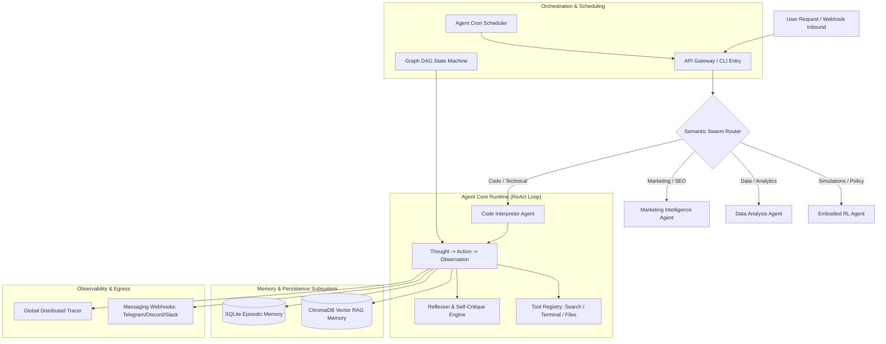

# 🤖 OpenClaw Agent Framework Architecture

The **OpenClaw Agent Framework** is TruthGPT's production-grade agentic layer, designed for complex task automation, environmental interaction, tool calling, and multi-agent swarm collaboration.

---

## 🏛️ Architecture & Component Topology

---

## 🔑 Key Pillars of OpenClaw

### 1. ReAct (Reasoning + Acting) Engine
Each agent operates on an iterative reasoning loop:
1. **Thought**: Decomposes user queries into intermediate reasoning chains.
2. **Action**: Selects and parameterizes a tool from the `ToolRegistry`.
3. **Observation**: Sandboxed execution and structured capture of tool stdout/stderr.
4. **Conclusion**: Produces the final verified response or iterates.

### 2. Auto-Reflexion Pattern
Before a final answer is returned, the agent invokes an internal self-evaluator model. If code failed execution, contained syntax errors, or missed edge cases, the agent critiques the error and self-corrects without requiring human intervention.

### 3. Dual-Tier Memory Architecture
- **Episodic Memory (SQLite)**: Stores raw conversation histories indexed by `user_id` and `session_id`.
- **Semantic Vector Memory (ChromaDB)**: Embeds interactions and facts into vector space, performing semantic retrieval to augment the prompt with relevant historical context.

### 4. Graph Orchestrator (State-Machine DAG)
For rigid enterprise workflows requiring strict sequencing, branching, and conditional loops, `GraphOrchestrator` allows developers to define explicit Directed Acyclic Graphs of agents and transitions.

### 5. Multi-Platform Webhook Integrations
Native bidirectional adapters for **Telegram**, **Discord**, **Slack**, **WhatsApp (Twilio)**, and **MS Teams** allow deploying agents as user-facing assistants with zero infrastructure boilerplate.
