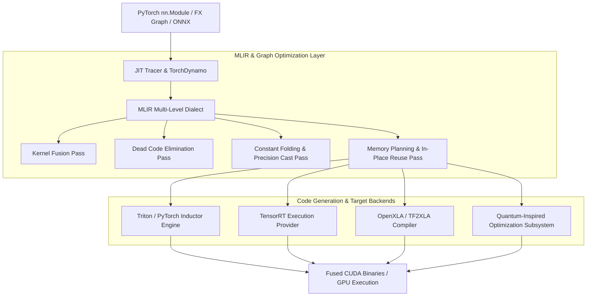

# ⚡ Compiler Runtime Architecture

The **TruthGPT Compiler Runtime** provides a multi-stage compilation framework designed to transform high-level PyTorch computational graphs into optimized, hardware-fused executables for training and ultra-low latency inference.

---

## 🏗️ Compiler Architecture Diagram

---

## 🛠️ Key Subsystems

### 1. MLIR Intermediate Representation (`compiler/mlir/`)
MLIR allows multi-level graph lowering:
- **High-Level Dialect (`tgh`)**: Represents transformer abstractions (MultiHeadAttention, LayerNorm, RotaryEmbedding).
- **Mid-Level Dialect (`tgm`)**: Represents linear algebra and elementwise tensor expressions.
- **Low-Level Dialect (`llvm`/`nvvm`)**: Target-specific instructions and GPU PTX code.

### 2. Ahead-of-Time (AOT) & JIT Engine (`compiler/jit/`, `compiler/aot/`)
- **TorchDynamo Integration**: Intercepts Python frame bytecode and extracts straight-line execution graphs.
- **AOT Autograd**: Pre-computes forward and backward graph derivatives to generate optimal fused backward kernels.

### 3. TensorRT Exporter (`compiler/tensorrt_engines/`)
- Generates serialized `.engine` plans optimized for NVIDIA Tensor Cores.
- Implements FP16, INT8, and FP8 calibration profiles.
- Dynamically allocates GPU execution contexts with optimal page-locked scratchpads.

### 4. Custom Hardware Kernels (`compiler/kernels/`)
Handcrafted CUDA and Triton kernels for operations that standard compilers fail to fuse:
- **Fused RoPE + Attention**: Applies rotary embedding directly inside the QK attention dot-product kernel.
- **Fused SwiGLU + Dropout**: Combines silu activation, linear gating, and dropout in a single SRAM pass.
- **Fused RMSNorm + Residual**: Eliminates global memory read-after-write cycles.

### 5. Quantum Subsystem (`compiler/runtime/subsystems/quantum.py`)
Provides quantum-inspired tensor network contractions and simulated annealing solvers to find optimal graph partitionings across multi-GPU clusters.
