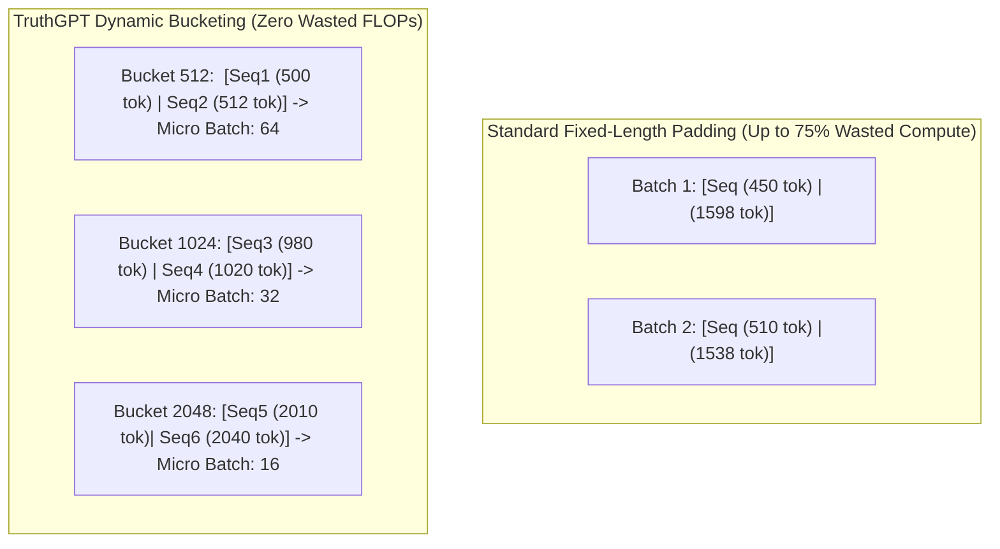

# Data Pipeline & Dynamic Bucketing

Data ingestion is frequently the hidden bottleneck in modern LLM training. TruthGPT Optimization Core includes a high-throughput, zero-padding data pipeline designed to maximize GPU FLOP utilization by eliminating wasted computation on padding tokens.

---

## ⚡ The Padding Inefficiency Problem

Standard data loaders pad all sequences in a dataset to the maximum sequence length (e.g. 2048 or 4096 tokens). If the average document is only 512 tokens long, up to **75% of compute cycles** are spent calculating attention across useless `<pad>` tokens:



---

## 🪣 Dynamic Token Bucketing Implementation

TruthGPT's `DynamicBucketingDataset` partitions sequences into homogeneous length clusters:

```python
from data.pipeline import DynamicBucketingDataset

# Initialize bucketing dataset from JSONL or Arrow datasets
dataset = DynamicBucketingDataset.from_jsonl(
    file_path="data/pretrain_corpus.jsonl",
    bucket_boundaries=[256, 512, 1024, 2048],
    batch_sizes=[128, 64, 32, 16],
    shuffle=True
)

# DataLoader yields length-matched micro-batches
dataloader = dataset.get_dataloader(num_workers=4, pin_memory=True)
```

---

## 🚀 Key Advantages

1. **2.5x to 4x Training Throughput**: Every attention matrix computation contains meaningful context tokens.
2. **Dynamic Batch Sizing**: Shorter sequence buckets automatically scale up micro-batch size to keep GPU VRAM fully saturated.
3. **Memory Safety**: Long sequence buckets automatically reduce micro-batch size to prevent CUDA Out-Of-Memory (OOM) exceptions.
