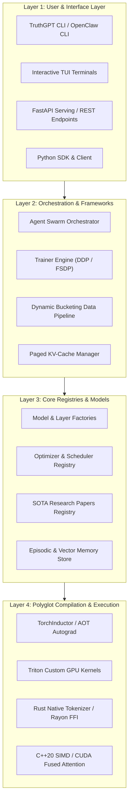

# 🏗️ System Architecture & Design Portal

TruthGPT Optimization Core is engineered around a **stratified, modular, polyglot architecture**. The system completely decouples high-level model definitions, distributed training loops, autonomous agent reasoning frameworks, and low-level hardware compilation targets.

---

## 🏛️ High-Level System Topology

---

## 🧭 Architecture Subsystems

-   :material-layers: **[System Overview](overview.md)**
    -   Detailed four-layer architectural model (Interface, Orchestration, Registry, Execution).
    -   End-to-end execution flow diagrams and component interaction sequences.
    -   Modular separation of concerns for enterprise scaling.

-   :material-translate: **[Polyglot Core Engine](polyglot_core.md)**
    -   Zero-copy tensor sharing and multi-language foreign function interfaces (FFI).
    -   Native Rust tokenizers, C++20 SIMD matrix operations, and Julia numerical physics.
    -   Cross-language memory safety and C-ABI bridge bindings.

-   :material-cpu-64-bit: **[Compiler Runtime Architecture](compiler_runtime.md)**
    -   Multi-stage lowering through MLIR dialects, TorchInductor JIT, and TensorRT.
    -   Automated Triton autotuning and fusion passes for maximum FLOP utilization.
    -   Graph capture, symbol caching, and kernel dispatch optimizations.

-   :material-atom: **[Physics-Informed MoE (PiMoE)](pimoe.md)**
    -   Sparse Mixture of Experts regularized by Hamiltonian conservation laws.
    -   Eliminating expert collapse with physical inductive biases and symplectic geometry.
    -   Dynamic load balancing across heterogeneous compute clusters.

-   :material-robot: **[OpenClaw Agent Framework](agent_framework.md)**
    -   Autonomous ReAct agents, semantic swarm routing, and graph orchestrators.
    -   Episodic memory (SQLite) and semantic long-term memory (ChromaDB / Vector Index).
    -   Sandboxed Python execution, tool calling, and self-correcting reflexion loops.

-   :material-database: **[Data Pipeline & Dynamic Bucketing](data_pipeline.md)**
    -   Zero-padding sequence clustering and dynamic micro-batch scaling.
    -   Eliminating wasted compute on padding tokens for $2.5\times$ to $4\times$ throughput speedup.
    -   Prefetching, sharding, and memory-mapped dataset streaming.

-   :material-view-grid: **[Models & Modular Layers](models_and_layers.md)**
    -   Composable building blocks: FlashAttention-2, RoPE, SwiGLU, and MoE routing.
    -   Factory pattern instantiation for seamless architectural customization.
    -   Standardized interfaces for Transformer backbones and custom architectures.

---

## 📊 Subsystem Responsibilities Matrix

| Layer / Subsystem | Primary Technologies | Key Capabilities | Target Hardware |
| :--- | :--- | :--- | :--- |
| **Interface** | Click, Rich, Textual, FastAPI | CLI commands, real-time TUI, OpenAI-compatible REST API | Any Host (Linux, macOS, Windows) |
| **Orchestration** | Asyncio, PyTorch DDP, FSDP | Swarm routing, multi-GPU gradient synchronization | Multi-GPU / Multi-Node Clusters |
| **Registries & Core** | Python Metaclasses, SQLite, ChromaDB | Dynamic plugin discovery, persistent memory, paper catalog | Host CPU & System RAM |
| **Compilation & Kernels** | Triton, C++20, Rust, CUDA | Block-level fused kernels, zero-copy tokenization, SIMD acceleration | NVIDIA Ampere, Ada Lovelace, Hopper, Blackwell |

---

## 🔗 Next Steps
- Review the [System Overview](overview.md) for architectural sequence diagrams.
- Dive into the [Compiler Runtime Architecture](compiler_runtime.md) for kernel compilation deep dives.
- Learn about the [OpenClaw Agent Framework](agent_framework.md) for multi-agent swarm development.
