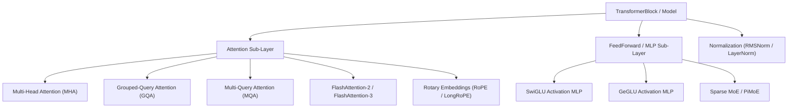

# Models & Layer Architecture

TruthGPT Optimization Core includes modular, high-efficiency building blocks for state-of-the-art Transformer and Mixture-of-Experts architectures.

---

## 🏛️ Modular Layer Hierarchy



---

## ⚡ Key Architectural Features

### 1. Grouped-Query Attention (GQA) & Multi-Query Attention (MQA)
Standard Multi-Head Attention maintains separate Key and Value heads for every Query head, dramatically inflating KV-Cache memory during autoregressive inference. TruthGPT implements GQA with configurable head ratios:

$$\text{KV-Heads} = \frac{\text{Query Heads}}{G}$$

For $G=8$, KV cache memory is reduced by **87.5%** with negligible perplexity degradation.

### 2. Rotary Position Embeddings (RoPE & LongRoPE)
RoPE applies complex planar rotations to Query and Key projections, enabling strong relative positional awareness:

$$R_{\Theta, m}^d = \text{diag}\left(R_{\theta_1, m}, R_{\theta_2, m}, \dots, R_{\theta_{d/2}, m}\right)$$

TruthGPT also integrates **LongRoPE**, scaling context windows from 4K to 128K+ tokens without fine-tuning instability.

### 3. SwiGLU Feed-Forward Networks
TruthGPT defaults to Swish-Gated Linear Units (SwiGLU), proven across LLaMA, Mistral, and Claude models to outperform standard ReLU/GELU MLPs:

$$\text{SwiGLU}(x) = (\text{Swish}(x W_{\text{gate}}) \odot x W_{\text{up}}) W_{\text{down}}$$

---

## 💻 Python Module Example

```python
from models.modules.attention import GroupedQueryAttention
from models.modules.feed_forward import SwiGLUFeedForward
from models.modules.normalization import RMSNorm
import torch
import torch.nn as nn

class OptimizedTransformerBlock(nn.Module):
    def __init__(self, d_model=1024, num_q_heads=16, num_kv_heads=4, d_ff=2816):
        super().__init__()
        self.input_norm = RMSNorm(d_model)
        self.attention = GroupedQueryAttention(
            d_model=d_model, 
            num_q_heads=num_q_heads, 
            num_kv_heads=num_kv_heads
        )
        self.post_attention_norm = RMSNorm(d_model)
        self.mlp = SwiGLUFeedForward(d_model=d_model, d_ff=d_ff)

    def forward(self, x, mask=None):
        # Pre-LN architecture with residual connections
        x = x + self.attention(self.input_norm(x), mask=mask)
        x = x + self.mlp(self.post_attention_norm(x))
        return x
```
