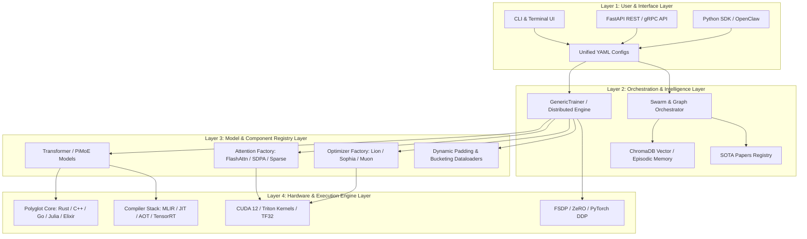
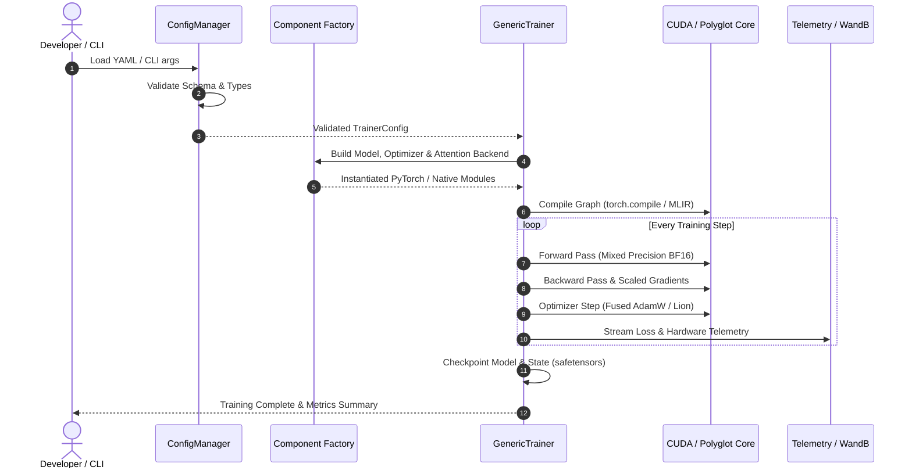

# 🏗️ System Architecture Overview

TruthGPT Optimization Core is built on a **modular, layered, registry-driven architecture**. This design cleanly decouples component definitions, hardware compilation targets, training orchestration, and agentic workflows.

---

## 🏛️ Four-Layer Architectural Model

---

## 🧩 Core Architectural Subsystems

### 1. Unified Configuration & Validation
All training, compilation, and agent parameters are specified in typed dataclasses (`TrainerConfig`, `TransformerConfig`, `AgentConfig`) with automatic YAML/JSON serialization and schema validation.

### 2. Registry & Factory Pattern
Components (optimizers, attention mechanisms, loss functions, tokenizers, schedulers) register dynamically using decorators (`@REGISTRY.register("name")`). This allows swapping deep learning kernels without modifying training loops.

### 3. Polyglot Core Acceleration
Performance-critical components are implemented across native languages:
- **Rust Core (`rust_core`)**: Zero-overhead memory allocators, parallel tokenizers, and concurrent streaming buffers.
- **C++ Core (`cpp_core`)**: Custom CUDA kernel wrappers, fused matrix multiplication, and TensorRT bindings.
- **Elixir / Julia / Go / Scala**: Concurrent task distribution, scientific tensor calculations, and IPC bridges.

### 4. Compiler Runtime Pipeline
- **MLIR Dialects**: Hardware-independent intermediate representation and graph transformation passes.
- **JIT / AOT Engine**: PyTorch Inductor and Triton kernel generation with automatic autotuning.
- **TensorRT Pipeline**: Graph parsing, weight quantization (FP16/INT8/FP8), and engine serialization.

### 5. OpenClaw Autonomous Agent System
- **ReAct Execution Engine**: Dynamic prompt formatting, scratchpad thought-action-observation cycles.
- **Semantic Swarm Router**: Embeds incoming queries and routes them to specialized agents.
- **Memory & Reflexion**: SQLite episodic memory, ChromaDB semantic memory, and iterative response self-critique.

---

## 🔄 End-to-End Execution Sequence

---

## 📚 Section Breakdown

- [System Architecture Index](index.md)
- [Polyglot Core Architecture](polyglot_core.md)
- [Compiler Runtime Architecture](compiler_runtime.md)
- [PiMoE Physics-Informed MoE](pimoe.md)
- [OpenClaw Agent Framework](agent_framework.md)
- [Data Pipeline & Dynamic Bucketing](data_pipeline.md)
- [Models & Modular Layers](models_and_layers.md)
