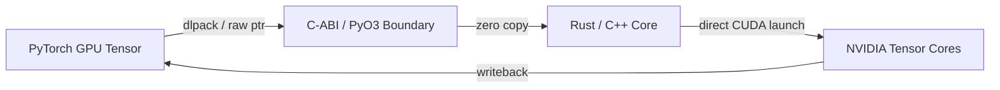

# 🌐 Polyglot Core Architecture

TruthGPT breaks beyond standard single-language constraints by utilizing a **Polyglot Acceleration Architecture**. Performance-critical algorithms, memory operations, and concurrent distributed operations are offloaded to specialized programming languages via zero-overhead C-ABI interfaces and PyO3 bindings.

---

## 🏛️ Multi-Language Responsibility Matrix

| Subsystem | Language | Key Responsibilities | Interface / Interop |
| :--- | :--- | :--- | :--- |
| **`rust_core`** | Rust (1.75+) | Zero-copy tensor buffers, high-speed tokenization, lock-free queues, custom CUDA FFI | `PyO3` / `maturin` / C-ABI |
| **`cpp_core`** | C++20 / CUDA | Fused matrix multiplication, custom CUDA/TensorRT execution providers, SIMD vectorization | `pybind11` / CMake |
| **`go_core`** | Go (1.21+) | High-concurrency cluster discovery, heartbeat monitoring, distributed telemetry streaming | gRPC / JSON-RPC |
| **`julia_core`**| Julia (1.9+) | Differentiable physics simulations for PiMoE, high-precision ODE solving | `PyCall` / Shared Object (`.so`/`.dll`) |
| **`elixir_core`**| Elixir / OTP | Fault-tolerant agent actor supervision, websocket push pipelines | Port Drivers / BEAM IPC |
| **`scala_core`** | Scala (3.x) | Large-scale dataset streaming, distributed sharding coordination | JVM Bridge / Apache Arrow |

---

## 🏎️ Polyglot Core Directory Structure

```
optimization_core/
├── polyglot_core/
│   ├── core/
│   │   ├── attention/engine.py         # Unified multi-backend attention engine
│   │   ├── ffn/engine.py               # SwiGLU / MoE polyglot dispatcher
│   │   └── memory/manager.py           # Cross-language buffer manager
│   └── bindings/                       # C-ABI and PyO3 foreign function bindings
├── rust_core/                          # Cargo workspace & native crates
│   ├── Cargo.toml
│   └── src/
│       ├── attention.rs                # Fused FlashAttention in Rust
│       └── tensor_ops.rs               # Memory-mapped tensor streaming
├── cpp_core/                           # CMake CUDA/C++ extension
│   ├── CMakeLists.txt
│   └── src/
│       ├── kernels.cu                  # Handcrafted CUDA matrix kernels
│       └── bindings.cpp                # PyBind11 exports
└── [go_core / julia_core / elixir_core]
```

---

## ⚡ Zero-Copy Tensor Sharing Pipeline

Tensors are shared between PyTorch (Python) and native Rust/C++ backends using the **DLPack standard** and raw memory pointers:



### Key Advantages:
1. **Zero Allocation Latency**: Native kernels operate directly on PyTorch GPU pointer addresses without memory re-allocation.
2. **Deterministic Garbage Collection**: Native memory buffers use RAII and ownership semantics to prevent GPU memory fragmentation and leaks.
3. **True Multi-Threaded Execution**: Rust and C++ workers release the Python GIL (Global Interpreter Lock) for full CPU multi-core utilization.
