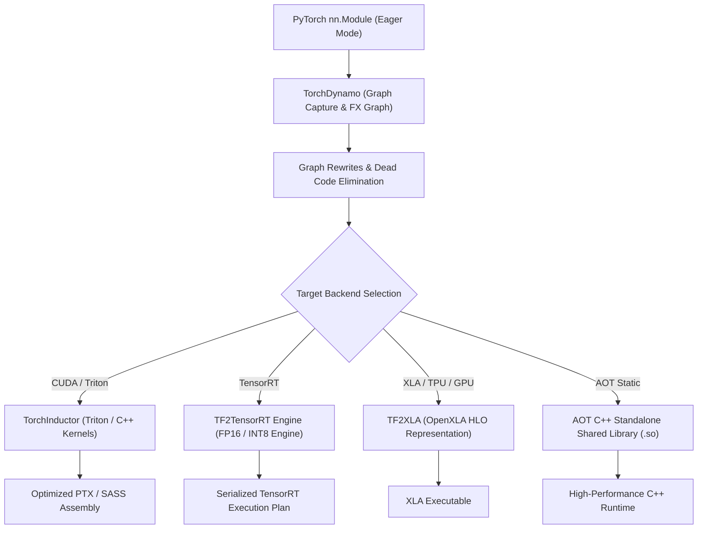

# TruthGPT Compiler Subsystem

The TruthGPT Compiler Subsystem (`compiler/`) provides an end-to-end Ahead-of-Time (AOT) and Just-in-Time (JIT) compilation pipeline, lowering PyTorch computational graphs through **MLIR**, **TorchInductor**, **TF2XLA**, and **TensorRT**.

---

## 🏗️ Compiler Architecture & Graph Lowering



---

## ⚡ Key Compiler Subsystems

### 1. TorchDynamo & TorchInductor (`compiler/jit/`)
- **Symbolic Shape Propagation**: Analyzes dynamic sequence lengths without triggering re-compilations at every batch dimension change.
- **Operator Fusion**: Fuses element-wise operations (GELU, RMSNorm, Add, Scale) directly into attention and GEMM memory streams.

### 2. AOT Standalone Export (`compiler/aot/`)
Compiles the entire model architecture into a standalone C++ shared library (`.so` / `.dll`) with zero Python runtime dependency, ideal for embedded systems and ultra-low-latency production microservices.

### 3. MLIR & TF2XLA Lowering (`compiler/mlir/` & `compiler/tf2xla/`)
Lowers neural operations into structured Multi-Level Intermediate Representation (MLIR) dialects, performing polyhedral loop transformations and automatic memory layout optimization.

---

## 🛠️ Python Usage Example

```python
from compiler.core.compiler import TruthGPTCompiler

# Initialize compiler with target optimization flags
compiler = TruthGPTCompiler(
    backend="inductor",
    precision="bf16",
    fuse_attention=True,
    enable_cuda_graphs=True
)

# Compile eager PyTorch model into optimized artifact
compiled_model = compiler.compile(model, sample_input_shape=(1, 512))

# Execute with zero Python overhead
output = compiled_model(input_ids)
```
