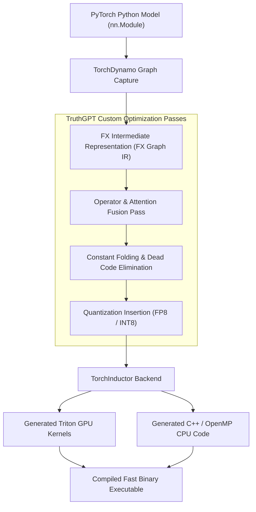

# Compiler Subsystem & JIT Graph Acceleration

The **TruthGPT Compiler Subsystem** integrates PyTorch 2.0+ graph compilation (`torch.compile`, TorchDynamo, TorchInductor, and AOTAutograd) with custom intermediate representation (IR) optimization passes and MLIR targets.

---

## 🏛️ Compiler Subsystem Topology



---

## ⚡ Compilation Modes & Performance

TruthGPT supports three compilation modes:

| Compile Mode | Compilation Overhead | Runtime Speedup | Ideal Use Case |
| :--- | :--- | :--- | :--- |
| `default` | Low (~10-20 sec) | 1.15x - 1.30x | Rapid prototyping & short training runs |
| `reduce-overhead` | Medium (~30-60 sec) | 1.25x - 1.50x | Small batch inference & latency-critical serving |
| `max-autotune` | High (~2-5 min) | 1.40x - 1.85x | Large-scale pretraining & production deployments |

---

## 💻 Python Usage Example

```python
from compiler.engine import CompilerEngine, CompilerConfig
import torch

# 1. Define compiler configuration
config = CompilerConfig(
    mode="max-autotune",
    backend="inductor",
    enable_triton_fusion=True,
    dynamic_shapes=True
)

# 2. Compile model instance
engine = CompilerEngine(config=config)
compiled_model = engine.compile(model)

# 3. Fast execution
inputs = torch.randn(32, 512, 1024, device="cuda")
outputs = compiled_model(inputs)
```
