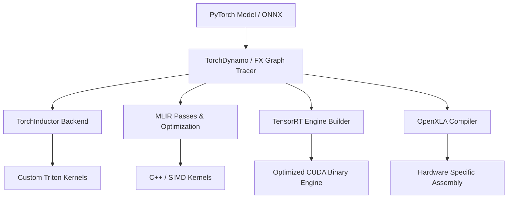

# Compiler & Acceleration Subsystem Overview

The **TruthGPT Compiler Subsystem** provides a deep learning compilation toolchain designed to bridge high-level PyTorch models and hardware execution targets (NVIDIA Tensor Cores, AMD ROCm, Apple Metal, and XLA accelerators).

---

## 🏗️ Compiler Subsystem Architecture

```
optimization_core/compiler/
├── aot/                    # Ahead-of-Time compilation & binary caching
├── jit/                    # Just-in-Time graph capturing & TorchDynamo frontends
├── mlir/                   # MLIR lowering, dialect conversion, and graph rewrites
├── tensorrt_engines/       # TensorRT engine generation & runtime bindings
├── tf2tensorrt/            # TensorFlow graph to TensorRT lowering
├── tf2xla/                 # XLA compilation backend bridge
├── neural/                 # Neural graph optimizer & pattern matcher
├── kernels/                # Custom Triton, CUDA & C++ high-performance kernels
├── distributed/            # Collective communication compiler & graph partitioner
└── runtime/                # High-performance execution runtime & monitoring
```

---

## ⚡ Compilation Backends



### 1. TorchInductor & Custom Triton
- **Target**: Training & Online Inference.
- **Mechanism**: Translates PyTorch FX graphs into parallel Triton C-code, compiling down to PTX without intermediate runtime overhead.
- **Fusion**: Automatically fuses LayerNorm + Linear, Attention + RoPE, and SwiGLU activation gates into single memory-resident CUDA kernels.

### 2. TensorRT Engine Builder
- **Target**: Ultra-low latency production inference.
- **Mechanism**: Performs FP16/FP8 layer calibration, tensor memory re-use, and kernel auto-tuning for specific GPU architectures (Hopper, Ada Lovelace, Ampere).

### 3. MLIR Optimization Pipeline
- **Target**: Intermediate dialect lowering and custom hardware accelerators.
- **Mechanism**: Constant propagation, dead-code elimination, and tensor layout transposition optimization.
