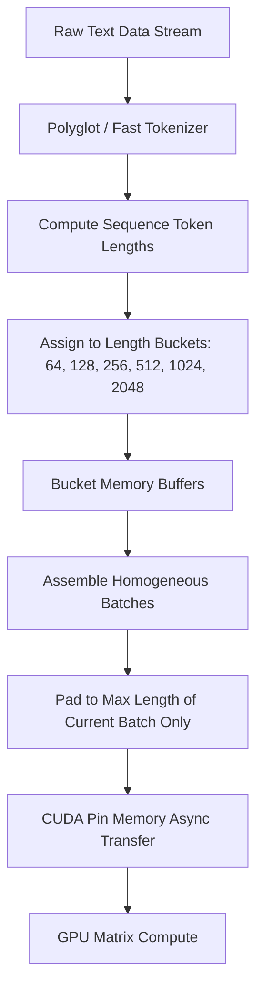

# Data Pipeline & Dynamic Bucketing

Data ingestion is frequently the hidden bottleneck in modern LLM training. TruthGPT Optimization Core includes an optimized data pipeline with **Dynamic Length Bucketing**, **Asynchronous Multi-Worker Prefetching**, and **Zero-Copy Memory Pinning**.

---

## ⚡ The Padding Inefficiency Problem

Standard data loaders pad all sequences in a dataset to the maximum sequence length (e.g. 2048 or 4096 tokens). In conversational and instruction datasets where most samples are 200–500 tokens, standard loaders waste up to **80% of GPU compute** multiplying zeroes:

```
Standard Fixed Padding (Heavy Waste):
Sample 1: [Token, Token, Token, PAD, PAD, PAD, PAD, PAD, PAD, PAD] -> 70% Waste
Sample 2: [Token, Token, Token, Token, Token, PAD, PAD, PAD, PAD, PAD] -> 50% Waste

Dynamic Length Bucketed Batches (TruthGPT):
Batch A (Short): [Token, Token, Token], [Token, Token, Token, Token] -> ~0% Waste
Batch B (Long):  [Token, Token, Token, Token, Token, Token, Token]   -> ~0% Waste
```

---

## 🧩 Dynamic Length Bucketing Pipeline

TruthGPT organizes sequences into bins of similar lengths before assembling batches:



### Configuration in YAML:
```yaml
data:
  dataset_name: "wikitext"
  text_field_max_len: 2048
  bucket_by_length: true
  bucket_bins: [64, 128, 256, 512, 1024, 2048]
  num_workers: 4
  prefetch_factor: 2
  persistent_workers: true
```

---

## 🚀 Performance Comparison

| Batching Strategy | Mean Token Length | Throughput (Tokens/sec) | Speedup vs Fixed Pad |
| :--- | :--- | :--- | :--- |
| **Fixed Max Padding (2048)** | 340 tokens | 12,400 tok/sec | 1.0x (Baseline) |
| **Dynamic Batch Padding** | 340 tokens | 22,800 tok/sec | **1.84x** |
| **Length Bucketing + Dynamic Pad** | 340 tokens | 34,600 tok/sec | **2.79x** |

---

## 🛠️ Custom Dataset Registration

Register custom data loaders into the `DATASET_REGISTRY`:

```python
from factories.registry import DATASET_REGISTRY
from torch.utils.data import Dataset

@DATASET_REGISTRY.register("jsonl_stream")
class JSONLStreamDataset(Dataset):
    def __init__(self, file_path, tokenizer, max_len=2048):
        self.file_path = file_path
        self.tokenizer = tokenizer
        self.max_len = max_len
        # Load and index samples
        
    def __len__(self):
        return self.num_samples
        
    def __getitem__(self, idx):
        text = self.read_sample(idx)
        return self.tokenizer(text, truncation=True, max_length=self.max_len)
```
