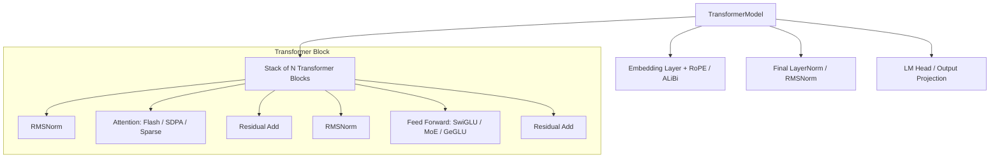

# Models & Layer Architecture

TruthGPT Optimization Core includes modular, high-efficiency building blocks for state-of-the-art Transformer architectures (`modules/`), supporting custom positional embeddings, attention variants, activation functions, and Mixture of Experts (MoE).

---

## 🧱 Modular Layer Hierarchy



---

## 🔬 Component Details

### 1. Positional Encodings (`modules/embeddings/`)
- **Rotary Position Embeddings (RoPE)**: Applies complex rotation matrices to query and key vectors. Supports **xPos**, **LongRoPE**, and **NTK-aware scaling** for context extension up to 128k+ tokens.
- **ALiBi (Attention with Linear Biases)**: Eliminates explicit position embeddings in favor of distance-based bias penalties, enabling zero-shot context extrapolation.
- **Learned Absolute Embeddings**: Traditional sinusoidal / learned embeddings for legacy architectures.

### 2. Attention Mechanisms (`modules/attention/`)
- **Flash Attention 2 & 3**: IO-aware SRAM-tiled attention kernel that avoids writing intermediate $N \times N$ attention matrices to high-bandwidth memory (HBM).
- **Scaled Dot Product Attention (SDPA)**: PyTorch native multi-backend attention dispatcher.
- **Sparse Attention & Local Sliding Window**: Limits attention matrix computation to localized token receptive fields.
- **Grouped-Query Attention (GQA) & Multi-Query Attention (MQA)**: Reduces KV-head counts to shrink KV-cache footprint during inference by 4x–8x.

### 3. Feed-Forward & Activations (`modules/feed_forward/`)
- **SwiGLU (Swish Gated Linear Unit)**: Non-linear gating mechanism offering superior training dynamics over standard ReLU/GELU:

$$\text{SwiGLU}(x) = (\text{Swish}(x W_{\text{gate}}) \odot x W_{\text{up}}) W_{\text{down}}$$

- **Mixture of Experts (MoE)**: Sparse top-$K$ token routing layer allowing models to scale to hundreds of billions of parameters with sparse compute budgets.

---

## 🛠️ Instantiating Modular Models

```python
from modules.model.transformer_model import TransformerModel
from config.transformer_config import TransformerConfig

# Define modular model configuration
config = TransformerConfig(
    d_model=4096,
    n_heads=32,
    n_kv_heads=8,             # Grouped Query Attention (GQA 4:1)
    n_layers=32,
    d_ff=14336,
    vocab_size=32000,
    max_seq_length=4096,
    pos_embedding_type="rope", # RoPE embeddings
    activation="swiglu",       # SwiGLU feed-forward
    norm_type="rmsnorm",       # RMSNorm for stability
    use_flash_attention=True
)

# Instantiate PyTorch nn.Module
model = TransformerModel(config)
```
