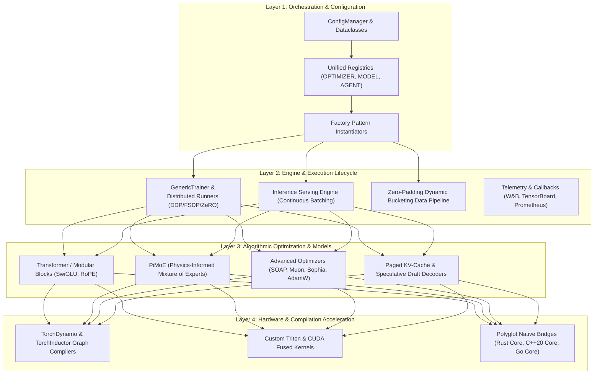

# Core System Architecture

TruthGPT Optimization Core is engineered as a **modular, registry-driven, polyglot deep learning framework**. This decoupled architecture isolates user configuration, runtime orchestration, algorithmic optimization, and hardware acceleration into clean, interoperable abstraction layers.

---

## 🏛️ Stratified Architectural Layers

The system is organized into four distinct architectural layers:



---

## 🧩 1. Registry & Factory Decoupling

TruthGPT uses dynamic registries to decouple model component definitions from core training routines. This allows developers to introduce new optimizers, attention backends, or agent architectures without modifying trainer loops:

```python
from registries.unified_registry import OPTIMIZER_REGISTRY
import torch.optim as optim

# Register a custom optimizer
@OPTIMIZER_REGISTRY.register("custom_adaptive_opt")
def build_custom_optimizer(model_params, lr=1e-3, **kwargs):
    return optim.AdamW(model_params, lr=lr, weight_decay=0.01)
```

---

## ⚡ 2. Component Execution Lifecycle

During a model training or inference session, the runtime manages state transitions deterministically:

1. **Pre-flight Validation**: `ConfigManager` audits all hardware flags, hyperparameter constraints, and GPU memory budgets.
2. **Factory Initialization**: The model, optimizer, learning rate scheduler, and loss criterion are constructed via `registries/`.
3. **Graph Compilation Pass**: If `compile_model=True`, PyTorch Dynamo captures computation graphs, applies fusion passes via TorchInductor, and generates optimized Triton code.
4. **Data Stream Ingestion**: Datasets are partitioned into length-matched buckets to eliminate zero-padding memory waste.
5. **Execution Loop**: Batches execute through forward, loss calculation, backward, gradient clipping, optimizer step, and telemetry hooks.
6. **Persistence & Recovery**: Model weights, optimizer state dicts, and RNG seeds are saved via asynchronous atomic checkpoints.
