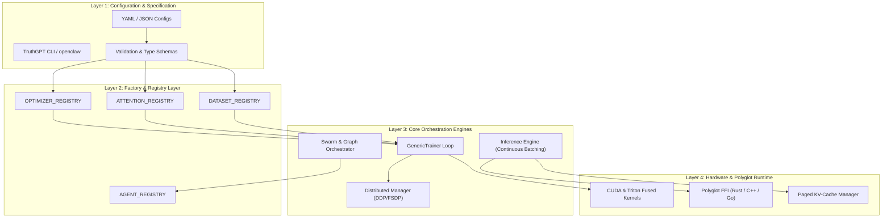

# Core System Architecture

TruthGPT Optimization Core is engineered as a **modular, registry-driven, polyglot deep learning framework**. The architecture strictly decouples component definition from runtime orchestration, enabling rapid experimentation, cross-language acceleration, and enterprise-grade fault tolerance.

---

## 🏛️ Stratified Architectural Layers

The system is organized into four distinct architectural layers:



---

## 🧩 The Registry Design Pattern

The foundation of TruthGPT's modularity is the **Registry Pattern**. This pattern allows developers to register new optimizers, attention backends, and data processors via simple decorators without modifying the core trainer logic.

### 1. Component Registration
```python
# Location: optimizers/lion.py
from factories.registry import OPTIMIZER_REGISTRY
import torch

@OPTIMIZER_REGISTRY.register("lion")
class LionOptimizer(torch.optim.Optimizer):
    def __init__(self, params, lr=1e-4, betas=(0.9, 0.99), weight_decay=0.0):
        defaults = dict(lr=lr, betas=betas, weight_decay=weight_decay)
        super().__init__(params, defaults)
        # Custom Lion update logic
```

### 2. Declaration in Configuration
```yaml
# In config.yaml
training:
  optimizer_type: "lion"
  learning_rate: 0.0001
  weight_decay: 0.01
```

### 3. Factory Instantiation
```python
# Location: trainers/trainer.py
from factories.registry import OPTIMIZER_REGISTRY

# Automatically builds LionOptimizer with params from config
optimizer = OPTIMIZER_REGISTRY.build(
    cfg.training.optimizer_type,
    model.parameters(),
    lr=cfg.training.learning_rate,
    weight_decay=cfg.training.weight_decay
)
```

---

## 🔄 Component Lifecycle & Execution Sequence

```mermaid
sequenceDiagram
    autonumber
    actor User as User / CLI
    participant Config as ConfigManager
    participant Trainer as GenericTrainer
    participant Model as ModelManager
    participant Data as DataManager
    participant Opt as OptimizerManager
    participant Checkpoint as CheckpointManager

    User->>Config: Load YAML / CLI args
    Config->>Trainer: Instantiated with TrainerConfig
    Trainer->>Model: Initialize / Load Weights (LoRA/Quant)
    Trainer->>Data: Build Bucketed DataLoader
    Trainer->>Opt: Instantiate Fused Optimizer & Cosine Scheduler
    Trainer->>Trainer: Compile Model (TorchInductor Graph Mode)

    loop Epoch Loop
        loop Batch Step
            Trainer->>Data: Fetch Batch (Dynamic Length)
            Trainer->>Model: Forward Pass (AMP BF16)
            Trainer->>Trainer: Compute Loss & Scale Gradients
            Trainer->>Opt: Backward Pass & Step
            Trainer->>Trainer: EMA Weight Accumulation
        end
        Trainer->>Trainer: Run Validation Pass
        Trainer->>Checkpoint: Save Async Safetensors Checkpoint
    end
```

---

## 🛡️ Enterprise Architecture Guarantees

1. **State Isolation**: Random number generators (RNG) are seeded deterministically across data loaders, CUDA streams, and model weight initializations.
2. **Crash Resilience**: Training state (optimizer states, RNG states, epoch step, EMA weights) is synchronized atomically to prevent corrupted checkpoint writes.
3. **Decoupled Telemetry**: Logging backends (W&B, TensorBoard, Console) are executed asynchronously via callbacks to eliminate blocking I/O bottlenecks.
