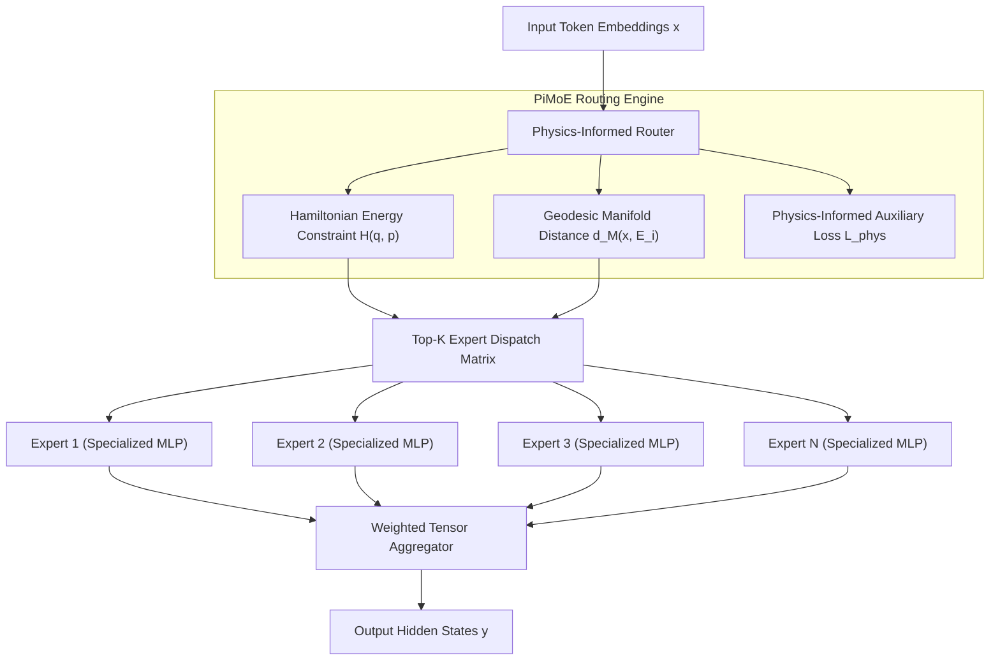

# Physics-Informed Mixture of Experts (PiMoE)

**PiMoE** (Physics-Informed Mixture of Experts) is TruthGPT's proprietary architecture fusing deep learning sparse routing with fundamental physical conservation laws, manifold constraints, and deterministic expert load balancing.

---

## 🔬 Conceptual Architecture

Standard Mixture of Experts (MoE) models route tokens purely based on learned statistical softmax distributions:

$$\text{Gate}(x) = \text{Softmax}(\text{TopK}(H(x) + \epsilon, k))$$

While effective, traditional gating suffers from **expert collapse**, representation drift, and severe load imbalance under out-of-distribution inputs. 

PiMoE solves this by introducing Hamiltonian energy conservation and geodesic manifold distances into the routing penalty:



---

## ⚡ Mathematical Formulation

1. **Hamiltonian Gating Energy**:
   Each expert $i$ is assigned a dynamic phase-space coordinate $(q_i, p_i)$. Gating probability is modulated by the Hamiltonian total energy:
   $$H(q, p) = \frac{1}{2} p^T M^{-1} p + V(q)$$
   $$\alpha_i(x) = \frac{\exp\left(W_r x_i - \lambda H_i\right)}{\sum_j \exp\left(W_r x_j - \lambda H_j\right)}$$

2. **Manifold Stability Regularization**:
   $$\mathcal{L}_{\text{total}} = \mathcal{L}_{\text{task}} + \beta \mathcal{L}_{\text{balance}} + \gamma \mathcal{L}_{\text{physics}}$$
   where $\mathcal{L}_{\text{physics}}$ penalizes non-conservative routing trajectories.

---

## 💻 Python Implementation Example

```python
from models.modules.feed_forward.pimoe_layer import PiMoELayer
import torch

# Initialize PiMoE with 8 experts and Top-2 routing
layer = PiMoELayer(
    d_model=1024,
    d_ff=4096,
    num_experts=8,
    top_k=2,
    physics_constraint_weight=0.01,
    load_balance_weight=0.02
)

# Forward pass with input hidden states
x = torch.randn(16, 128, 1024)
output, aux_loss = layer(x)

print(f"Output Tensor Shape: {output.shape}")
print(f"Physics Auxiliary Loss: {aux_loss.item():.6f}")
```
