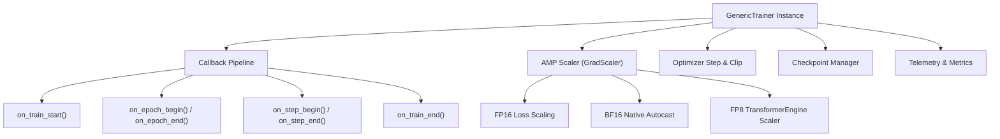

# Training Engine & Orchestration

The `GenericTrainer` class (`trainers/trainer.py`) serves as the central orchestration engine of the TruthGPT Optimization Core. It is designed to abstract training boilerplate while supporting state-of-the-art acceleration strategies including Automatic Mixed Precision (AMP), gradient accumulation, Distributed Data Parallel (DDP), Fully Sharded Data Parallel (FSDP), and dynamic callback pipelines.

---

## 🏛️ Trainer Subsystem Architecture



---

## 🔄 The Training Step Lifecycle

Each optimization step in `GenericTrainer` follows a rigorous sequence:

```python
def train_step(self, batch):
    self.optimizer.zero_grad(set_to_none=True)
    
    # 1. Automatic Mixed Precision Forward Pass
    with torch.autocast(device_type=self.device_type, dtype=self.amp_dtype, enabled=self.config.use_amp):
        outputs = self.model(**batch)
        loss = self.criterion(outputs, batch['labels'])
        loss = loss / self.config.gradient_accumulation_steps

    # 2. Mixed Precision Scaled Backward Pass
    self.scaler.scale(loss).backward()

    # 3. Gradient Accumulation & Step Execution
    if (self.global_step + 1) % self.config.gradient_accumulation_steps == 0:
        self.scaler.unscale_(self.optimizer)
        torch.nn.utils.clip_grad_norm_(self.model.parameters(), self.config.max_grad_norm)
        self.scaler.step(self.optimizer)
        self.scaler.update()
        self.lr_scheduler.step()

    return loss.item() * self.config.gradient_accumulation_steps
```

---

## 🧩 Event Callbacks & Hooks

TruthGPT provides modular hooks allowing custom extensions to execute at any phase of the training loop:

```python
from trainers.callbacks import BaseCallback

class EarlyStoppingCallback(BaseCallback):
    def __init__(self, patience=3):
        self.patience = patience
        self.best_loss = float("inf")
        self.counter = 0

    def on_epoch_end(self, trainer, epoch, metrics):
        val_loss = metrics.get("val_loss", float("inf"))
        if val_loss < self.best_loss:
            self.best_loss = val_loss
            self.counter = 0
        else:
            self.counter += 1
            if self.counter >= self.patience:
                trainer.should_stop = True
                print(f"Early stopping triggered at epoch {epoch}")
```
