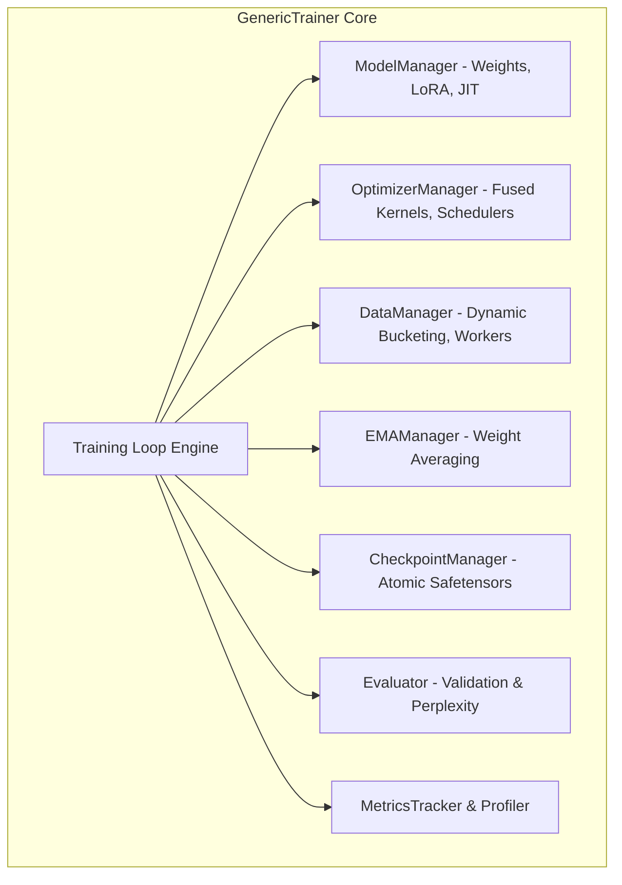
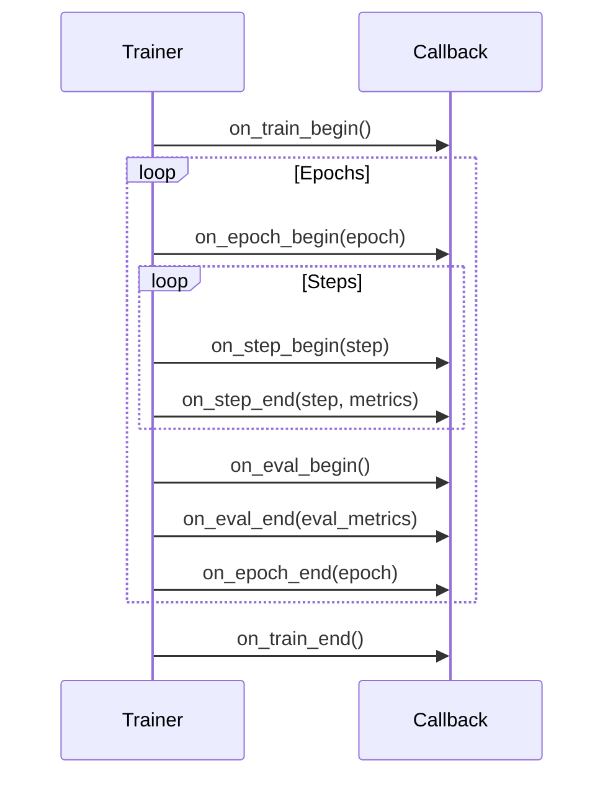

# Training Engine & Orchestration

The `GenericTrainer` class (`trainers/trainer.py`) serves as the central orchestration engine of the TruthGPT Optimization Core. It encapsulates high-performance distributed training, automatic mixed precision, gradient accumulation, exponential moving averages, and fault-tolerant checkpointing.

---

## 🏗️ Trainer Subsystem Architecture



---

## ⚡ Key Trainer Features

### 1. Automatic Precision & Scaled Backpropagation
The trainer dynamically configures precision according to detected hardware:
- **BFloat16 (BF16)**: Direct native execution without scaling overhead.
- **Float16 (FP16)**: Backed by `torch.cuda.amp.GradScaler` with dynamic scale adjustment and underflow recovery.
- **TensorFloat-32 (TF32)**: Configured globally via `torch.backends.cuda.matmul.allow_tf32 = True`.

### 2. Gradient Accumulation with Synchronized Step Boundaries
Gradient accumulation enables training with large effective batch sizes without exhausting GPU VRAM:

$$\text{Effective Batch Size} = \text{Batch Size per Device} \times \text{Gradient Accumulation Steps} \times N_{\text{GPUs}}$$

The trainer manages backward loss scaling:
```python
loss = loss / cfg.grad_accum_steps
scaler.scale(loss).backward()

if (step + 1) % cfg.grad_accum_steps == 0:
    scaler.unscale_(optimizer)
    torch.nn.utils.clip_grad_norm_(model.parameters(), cfg.max_grad_norm)
    scaler.step(optimizer)
    scaler.update()
    optimizer.zero_grad(set_to_none=True)
    if cfg.ema_enabled:
        ema_manager.update(model)
```

### 3. Exponential Moving Average (EMA)
EMA maintains a slowly decaying average of model weights during training:

$$\theta_{\text{EMA}}^{(t)} = \beta \cdot \theta_{\text{EMA}}^{(t-1)} + (1 - \beta) \cdot \theta^{(t)}$$

where $\beta \approx 0.999$. During evaluation and final checkpoint export, EMA weights produce smoother loss landscapes and improved out-of-distribution generalization.

### 4. Asynchronous & Atomic Checkpointing
Checkpoints are saved using `safetensors` format with atomic filesystem rename operations:
- Prevents partially written checkpoints during hardware or power interruptions.
- Preserves full training state: optimizer state dictionaries, RNG states, step counters, learning rate schedules, and EMA weights.
- Automatically maintains only the top $K$ checkpoints (`cfg.ckpt_keep_last`) to conserve disk space.

---

## 📋 Callback Lifecycle Hooks

TruthGPT provides an extensible callback system:



### Available Built-In Callbacks:
- `ConsoleLoggingCallback`: Colored terminal progress bar and step diagnostics.
- `WandbCallback`: Real-time streaming to Weights & Biases dashboards.
- `TensorBoardCallback`: Loss curves, gradient norms, and learning rate histories.
- `EarlyStoppingCallback`: Halts training when validation loss stops improving.
- `ProfilerCallback`: PyTorch CUDA profiler traces exportable to Chrome Trace (`chrome://tracing`).
