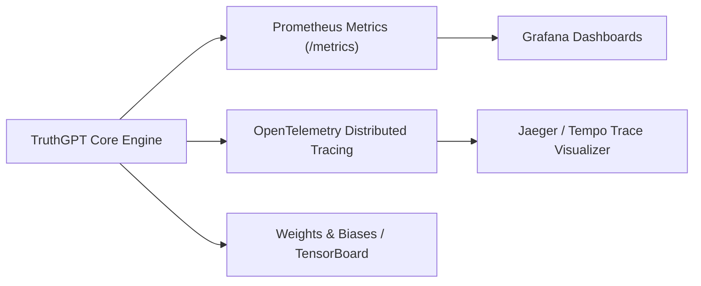

# Monitoring, Observability & Distributed Tracing

TruthGPT provides full-stack telemetry and observability, integrating **Prometheus**, **Grafana**, **OpenTelemetry Distributed Tracing**, and **Weights & Biases (W&B)**.

---

## 📊 Full Observability Stack



---

## 📈 Prometheus Metrics Reference

| Metric Name | Type | Description |
| :--- | :--- | :--- |
| `truthgpt_inference_requests_total` | Counter | Total count of HTTP/gRPC inference requests |
| `truthgpt_inference_latency_seconds` | Histogram | Request end-to-end latency distribution |
| `truthgpt_tokens_generated_total` | Counter | Cumulative tokens produced across all models |
| `truthgpt_gpu_memory_utilization_ratio` | Gauge | Active GPU memory as a fraction of total capacity |
| `truthgpt_kv_cache_allocated_blocks` | Gauge | Number of active virtual pages in Paged KV-Cache |
| `truthgpt_training_loss` | Gauge | Instantaneous training step loss |
| `truthgpt_training_mfu` | Gauge | Model FLOPs Utilization (MFU) efficiency % |

---

## 🔍 OpenTelemetry Distributed Tracing (`agents/observability.py`)

Trace deeply nested multi-agent tool invocations, database lookups, and neural forward passes:

```python
from agents.framework.observability import global_tracer

# 1. Start root trace
trace_id = global_tracer.start_trace("customer_inquiry", agent_name="SupportAgent")

# 2. Record sub-operation spans
with global_tracer.span(trace_id, "vector_memory_lookup", kind="db"):
    # Perform vector similarity query
    pass

with global_tracer.span(trace_id, "llm_generate", kind="model"):
    # Forward pass through model
    pass

global_tracer.finish_trace(trace_id, status="success")
```
