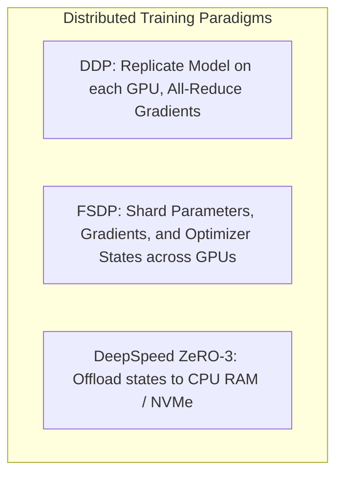

# Production Deployment & Distributed Scaling

TruthGPT Optimization Core is built for enterprise infrastructure, supporting **Kubernetes**, **Helm**, **Distributed Data Parallel (DDP)**, **Fully Sharded Data Parallel (FSDP)**, and **DeepSpeed ZeRO**.

---

## 🌐 Distributed Training Architectures



### 1. Multi-GPU Training with PyTorch DDP / Accelerate
Launch training across 8 GPUs on a single node:

```bash
torchrun --nproc_per_node=8 train_llm.py --config configs/presets/performance_max.yaml
```

### 2. Multi-Node Cluster Execution (SLURM / Kubernetes)
```bash
# SLURM submission script snippet
#SBATCH --nodes=4
#SBATCH --ntasks-per-node=8
#SBATCH --gpus-per-node=8

srun torchrun \
    --nnodes=4 \
    --nproc_per_node=8 \
    --rdzv_id=truthgpt_run_01 \
    --rdzv_backend=c10d \
    --rdzv_endpoint=$MASTER_ADDR:$MASTER_PORT \
    train_llm.py --config configs/presets/enterprise_production.yaml
```

---

## ☸️ Kubernetes & Helm Deployment

Deploying high-throughput inference pods on Kubernetes with NVIDIA GPU device plugins:

```yaml
# k8s/truthgpt-inference-deployment.yaml
apiVersion: apps/v1
kind: Deployment
metadata:
  name: truthgpt-inference
  labels:
    app: truthgpt-engine
spec:
  replicas: 4
  selector:
    matchLabels:
      app: truthgpt-engine
  template:
    metadata:
      labels:
        app: truthgpt-engine
    spec:
      containers:
      - name: truthgpt
        image: truthgpt-core:latest
        command: ["python", "cli.py", "serve", "--port", "8080", "--workers", "4"]
        resources:
          limits:
            nvidia.com/gpu: 1
            memory: 32Gi
            cpu: "8"
          requests:
            nvidia.com/gpu: 1
            memory: 16Gi
            cpu: "4"
        ports:
        - containerPort: 8080
        readinessProbe:
          httpGet:
            path: /healthz
            port: 8080
          initialDelaySeconds: 15
          periodSeconds: 10
```
