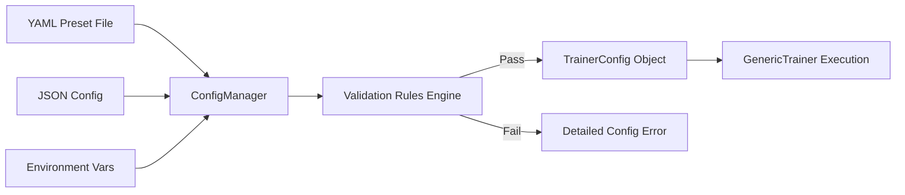

# Unified Configuration System

TruthGPT Optimization Core employs a centralized, strongly typed configuration system powered by Python dataclasses and YAML/JSON schemas with built-in validation rules.

---

## ⚙️ Configuration Architecture

The configuration workflow validates all hyperparameters before initializing neural network weights or allocating GPU memory:



---

## 📄 Complete YAML Schema Reference

Here is a full annotated YAML configuration showing all available options:

```yaml
# configs/presets/enterprise_production.yaml

model:
  name_or_path: "meta-llama/Llama-2-7b-hf"
  trust_remote_code: false
  gradient_checkpointing: true     # Recomputes activations in backward pass (saves 70% VRAM)
  save_safetensors: true          # Fast, memory-mapped checkpoint format
  
  # LoRA / QLoRA Configuration
  lora:
    enabled: true
    r: 16                         # Rank dimension (e.g. 8, 16, 32, 64)
    alpha: 32                     # Scaling factor (recommended: 2 * r)
    dropout: 0.05                 # LoRA layer dropout
    target_modules: ["q_proj", "v_proj", "k_proj", "o_proj", "gate_proj", "up_proj", "down_proj"]

training:
  epochs: 3
  train_batch_size: 4             # Batch size per GPU
  eval_batch_size: 8
  grad_accum_steps: 8             # Effective batch size = 4 * 8 = 32
  learning_rate: 0.0002
  weight_decay: 0.01
  max_grad_norm: 1.0              # Gradient clipping threshold
  
  # Optimizer & Scheduler
  optimizer_type: "fused_adamw"   # fused_adamw, lion, sophia, prodigy, adamw_8bit
  scheduler: "cosine"             # cosine, linear, constant, one_cycle
  warmup_ratio: 0.03              # 3% warmup steps
  
  # Precision & Hardware Compilation
  mixed_precision: "bf16"         # bf16, fp16, none
  allow_tf32: true                # Fast 19-bit TensorFloat-32 on Ampere+
  torch_compile: true             # JIT graph compilation via TorchInductor
  compile_mode: "default"         # default, reduce-overhead, max-autotune

data:
  dataset_name: "wikitext"
  dataset_subset: "wikitext-103-raw-v1"
  text_field_max_len: 2048
  bucket_by_length: true          # Dynamic padding & length grouping
  num_workers: 4
  prefetch_factor: 2
  persistent_workers: true

logging:
  output_dir: "runs/llama2_enterprise"
  log_interval: 20                # Steps between terminal/metric logging
  eval_interval: 250              # Steps between validation passes
  ckpt_interval_steps: 500        # Steps between checkpoint saves
  ckpt_keep_last: 3               # Retain only N most recent checkpoints
  
  # Exponential Moving Average
  ema_enabled: true
  ema_decay: 0.999

  # Observability Integrations
  callbacks:
    - console
    - tensorboard
    - wandb
  wandb_project: "truthgpt-enterprise"
  wandb_run_name: "llama2-7b-production"
```

---

## 🐍 Python Dataclass API

You can programmatically construct and inspect configurations:

```python
from trainers.config import TrainerConfig

# Create configuration programmatically
config = TrainerConfig(
    model_name="gpt2",
    output_dir="runs/my_experiment",
    epochs=5,
    train_batch_size=8,
    grad_accum_steps=2,
    learning_rate=1e-4,
    mixed_precision="bf16",
    allow_tf32=True,
    torch_compile=False,
    fused_adamw=True,
    ema_enabled=True,
    ema_decay=0.999
)

# Export to dictionary or YAML
config_dict = config.to_dict()
```

---

## 🌐 Environment Variable Overrides

Any configuration parameter can be overridden using environment variables prefixed with `TRUTHGPT_`:

```bash
export TRUTHGPT_MODEL_NAME="meta-llama/Llama-2-13b-hf"
export TRUTHGPT_TRAIN_BATCH_SIZE=2
export TRUTHGPT_GRAD_ACCUM_STEPS=16
export TRUTHGPT_MIXED_PRECISION="bf16"
export TRUTHGPT_TORCH_COMPILE="true"

# Launch training with env overrides active
python train_llm.py --config configs/base.yaml
```

---

## 🛡️ Validation Rules Engine

TruthGPT enforces strict integrity checks prior to training:
1. **Precision / Hardware Alignment**: Flags `bf16` on older GPUs (V100/T4) and suggests `fp16`.
2. **Effective Batch Size Consistency**: Calculates `batch_size * grad_accum_steps * num_gpus` and warns if too small or excessively large.
3. **LoRA Rank Compatibility**: Ensures `lora_alpha` and `lora_r` maintain positive numerical stability.
4. **Checkpoint Directory Write Permissions**: Tests disk write access and remaining capacity.
