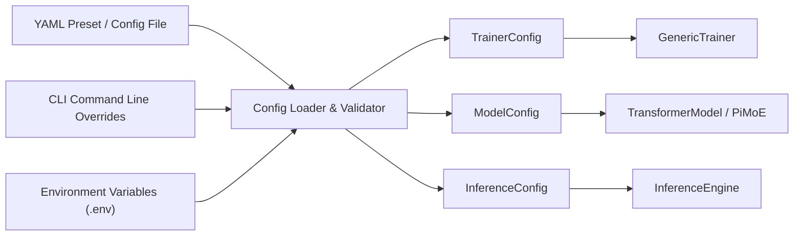

# Unified Configuration System

TruthGPT Optimization Core employs a centralized, strongly typed configuration system powered by Python dataclasses and Pydantic validation schemas.

---

## 🏛️ Configuration Architecture

The configuration engine validates all hyperparameters before initializing neural network weights or allocating GPU VRAM, preventing runtime crashes during training runs.



---

## 📄 Complete Training Configuration Schema

Below is a complete, production-validated `TrainerConfig` reference:

```python
from dataclasses import dataclass, field
from typing import Optional, List, Dict, Any

@dataclass
class TrainerConfig:
    # --- Experiment Identity ---
    experiment_name: str = "truthgpt-transformer-run-01"
    output_dir: str = "checkpoints/run_01"
    seed: int = 42

    # --- Hardware & Acceleration ---
    device: str = "cuda"                       # 'cuda', 'cpu', or 'mps'
    use_amp: bool = True                       # Automatic Mixed Precision
    amp_dtype: str = "bfloat16"                # 'bfloat16', 'float16', or 'fp8'
    compile_model: bool = True                 # PyTorch 2.x TorchInductor JIT
    compile_mode: str = "default"              # 'default', 'reduce-overhead', 'max-autotune'
    use_flash_attention: bool = True           # FlashAttention-2 / FlashAttention-3
    gradient_checkpointing: bool = False       # Activation recomputation for large models

    # --- Optimization & Schedulers ---
    optimizer_type: str = "soap"               # 'soap', 'muon', 'adamw', 'sophia', 'lion'
    learning_rate: float = 3e-4
    weight_decay: float = 0.01
    beta1: float = 0.9
    beta2: float = 0.95
    eps: float = 1e-8
    lr_scheduler_type: str = "cosine"          # 'cosine', 'linear', 'warmup_decay', 'wsd'
    warmup_steps: int = 500
    max_steps: Optional[int] = None
    max_epochs: int = 5

    # --- Batching & Gradients ---
    batch_size: int = 32                       # Per-device micro batch size
    gradient_accumulation_steps: int = 4       # Effective batch size = 32 * 4 = 128
    max_grad_norm: float = 1.0

    # --- Data Ingestion ---
    max_seq_len: int = 2048
    dynamic_bucketing: bool = True             # Zero-padding token sequence length bucketing
    num_workers: int = 4
    pin_memory: bool = True

    # --- Checkpointing & Telemetry ---
    save_checkpoint_freq: int = 1              # Save every N epochs
    save_best_only: bool = True
    logging_steps: int = 10
    use_wandb: bool = False
    use_tensorboard: bool = True
    export_prometheus_metrics: bool = True
```

---

## ⚙️ Loading and Overriding Configurations

### 1. Loading from YAML Files

```python
from config.manager import ConfigManager

# Load base configuration
config = ConfigManager.load_trainer_config("configs/presets/transformer_1b_sota.yaml")

# Modify fields programmatically
config.batch_size = 64
config.optimizer_type = "muon"
```

### 2. Loading with Dynamic CLI Overrides

```bash
python train_llm.py \
    --config configs/base_training.yaml \
    --override batch_size=16 \
    --override learning_rate=5e-4 \
    --override optimizer_type=soap
```

### 3. Validating Configurations

TruthGPT includes a validation utility to check configuration constraints before launching compute jobs:

```bash
python validate_config.py --config configs/presets/transformer_1b_sota.yaml
```
