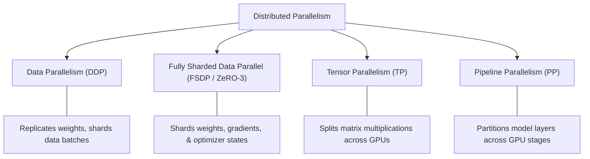

# 🌐 Practical Guide: Distributed Training, FSDP & Multi-Node Orchestration

This guide provides end-to-end instructions for configuring, benchmarking, and executing multi-GPU and multi-node distributed training runs with TruthGPT across GPU clusters (AWS EC2, Lambda Labs, RunPod, GCP, Azure, and on-premise InfiniBand clusters).

---

## 🏗️ 1. Distributed Parallelism Paradigms in TruthGPT

TruthGPT natively supports the full spectrum of distributed deep learning parallelism paradigms:



### Strategy Comparison:

| Strategy | Memory per GPU | Comm. Overhead | Recommended Model Size | Best Suited For |
| :--- | :--- | :--- | :--- | :--- |
| **DistributedDataParallel (DDP)** | $O(N)$ (Full model replicated) | Low (All-Reduce gradients) | $< 7\text{B}$ parameters | Single-node / small models |
| **FSDP (ZeRO-3)** | $O(N / G)$ (Fully sharded across $G$ GPUs) | Moderate (All-Gather + Reduce-Scatter) | $7\text{B} - 100\text{B}+$ parameters | Multi-GPU & Multi-Node fine-tuning |
| **Tensor Parallelism (TP)** | $O(N / T)$ (Intra-layer split) | High (Requires NVLink bandwidth) | Any large transformer layer | Ultra-low latency inference & training |
| **FSDP + TP Hybrid (2D)** | Minimized | Optimized for intra/inter-node | $> 70\text{B}$ frontier models | Large supercomputer clusters |

---

## ⚙️ 2. Production YAML Configuration for FSDP

Define your distributed run configuration in `configs/cluster_fsdp_run.yaml`:

```yaml
model:
  name: "meta-llama/Llama-2-70b"
  gradient_checkpointing: true
  save_safetensors: true

distributed:
  backend: "fsdp"
  sharding_strategy: "full_shard"    # Options: "full_shard", "shard_grad_op", "no_shard", "hybrid_shard"
  mixed_precision: "bf16"            # "bf16", "fp16", or "fp32"
  backward_prefetch: "backward_pre"  # Overlap gradient communication with backward pass
  forward_prefetch: true             # Overlap next layer all-gather with forward compute
  limit_all_gathers: true            # Prevents out-of-memory spikes from concurrency
  cpu_offload: false                 # Enable to offload optimizer/params to host RAM if VRAM is constrained
  auto_wrap_policy:
    transformer_layer_cls: "TransformerBlock"
    min_num_params: 100000000

optimization:
  optimizer: "lion"
  learning_rate: 1.0e-4
  weight_decay: 0.01
  allow_tf32: true
  torch_compile: true
  compile_mode: "reduce-overhead"

training:
  epochs: 3
  train_batch_size: 2
  grad_accum_steps: 16
  eval_batch_size: 2
  seed: 42

data:
  dataset_name: "wikitext"
  dataset_config_name: "wikitext-2-raw-v1"
  text_field_max_len: 4096
  bucket_by_length: true
  num_workers: 8

logging:
  output_dir: "runs/cluster_llama70b_fsdp"
  log_interval: 10
  eval_interval: 100
  ckpt_interval_steps: 500
  ckpt_keep_last: 3
```

---

## 🛠️ 3. Hardware & Network Environment Verification

Prior to launching multi-node jobs, verify NCCL communication, NVLink topology, and InfiniBand fabrics:

```bash
# 1. Inspect GPU Topology and NVLink connections
nvidia-smi topo -m

# 2. Check InfiniBand interfaces and Link State
ibstat
ibv_devinfo

# 3. Recommended NCCL Environment Variables for Multi-Node:
export NCCL_DEBUG=INFO
export NCCL_DEBUG_SUBSYS=ALL
export NCCL_IB_DISABLE=0
export NCCL_IB_CUDA_SUPPORT=1
export NCCL_NET_GDR_LEVEL=5
export NCCL_SOCKET_IFNAME=eth0
export TORCH_NCCL_ASYNC_ERROR_HANDLING=1
```

---

## 🚀 4. Launching Distributed Training

### Option A: Single Node (8x GPUs on a Single Host)

```bash
torchrun \
    --nproc_per_node=8 \
    train_llm.py \
    --config configs/cluster_fsdp_run.yaml
```

---

### Option B: Multi-Node Cluster Execution (e.g. 4 Nodes $\times$ 8 GPUs = 32 GPUs)

#### Master Node (Node 0 — IP: `10.0.0.1`):
```bash
torchrun \
    --nnodes=4 \
    --nproc_per_node=8 \
    --node_rank=0 \
    --master_addr=10.0.0.1 \
    --master_port=29500 \
    train_llm.py \
    --config configs/cluster_fsdp_run.yaml
```

#### Worker Nodes (Node 1, Node 2, Node 3):
Run the exact same command on each worker node, adjusting `--node_rank` accordingly:

```bash
# On Node 1 (IP: 10.0.0.2)
torchrun --nnodes=4 --nproc_per_node=8 --node_rank=1 --master_addr=10.0.0.1 --master_port=29500 train_llm.py --config configs/cluster_fsdp_run.yaml

# On Node 2 (IP: 10.0.0.3)
torchrun --nnodes=4 --nproc_per_node=8 --node_rank=2 --master_addr=10.0.0.1 --master_port=29500 train_llm.py --config configs/cluster_fsdp_run.yaml

# On Node 3 (IP: 10.0.0.4)
torchrun --nnodes=4 --nproc_per_node=8 --node_rank=3 --master_addr=10.0.0.1 --master_port=29500 train_llm.py --config configs/cluster_fsdp_run.yaml
```

---

## 🛡️ 5. Fault Tolerance & Elastic Checkpoint Recovery

TruthGPT distributed trainers support atomic sharded checkpoint saving via `trainers.checkpointing.CheckpointManager`. If a node disconnects or an unrecoverable hardware exception occurs:

1. The training process automatically exits with status code `100` (Restart Signal).
2. The orchestrator re-launches the job on healthy nodes.
3. TruthGPT loads the latest sharded optimizer and parameter rank states seamlessly:

```python
from trainers.checkpointing import CheckpointManager

ckpt_mgr = CheckpointManager(
    checkpoint_dir="runs/cluster_llama70b_fsdp",
    keep_last=3,
    save_sharded=True   # Zero-overhead parallel I/O from each GPU rank
)

# Resume state
latest_step = ckpt_mgr.resume_if_available(model, optimizer, scheduler)
print(f"Resumed training at step {latest_step}")
```
