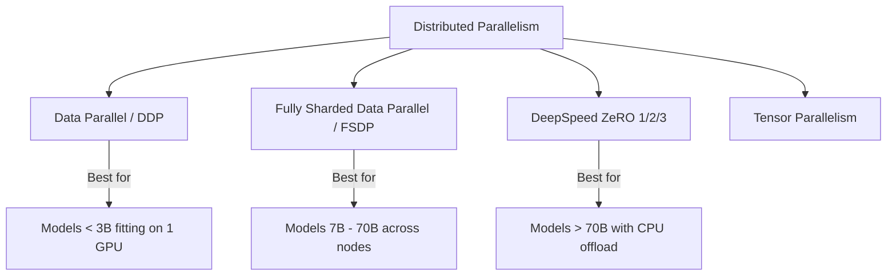

# 🌐 Distributed Training Guide

TruthGPT scales seamlessly across multi-GPU single-node workstations and multi-node compute clusters using PyTorch DDP, Fully Sharded Data Parallel (FSDP), and DeepSpeed ZeRO.

---

## 🏛️ Distributed Parallelism Strategies



---

## 🚀 1. Launching Multi-GPU Training via `torchrun`

To launch training across 4 local GPUs:

```bash
torchrun --nproc_per_node=4 train_llm.py \
    --config configs/presets/performance_max.yaml \
    --distributed
```

---

## ⚡ 2. Fully Sharded Data Parallel (FSDP)

FSDP shards model parameters, optimizer states, and gradients across all available GPUs, reconstituting weights only during forward and backward passes.

### Configuration (`configs/distributed_fsdp.yaml`):
```yaml
distributed:
  backend: "fsdp"
  sharding_strategy: "FULL_SHARD"        # 'FULL_SHARD', 'SHARD_GRAD_OP', or 'NO_SHARD'
  mixed_precision: "bf16"
  cpu_offload: false                     # Set True if model exceeds total VRAM
  backward_prefetch: "BACKWARD_PRE"
  forward_prefetch: true
  limit_all_gathers: true
```

---

## 💾 3. DeepSpeed ZeRO Integration

For extreme scale training with zero-redundancy optimizer state sharding:

```yaml
distributed:
  backend: "deepspeed"
  deepspeed_config:
    zero_optimization:
      stage: 3
      offload_optimizer:
        device: "cpu"
        pin_memory: true
      overlap_comm: true
      contiguous_gradients: true
    bf16:
      enabled: true
```

Launch with the DeepSpeed CLI:
```bash
deepspeed --num_gpus=8 train_llm.py --config configs/deepspeed_stage3.yaml
```
