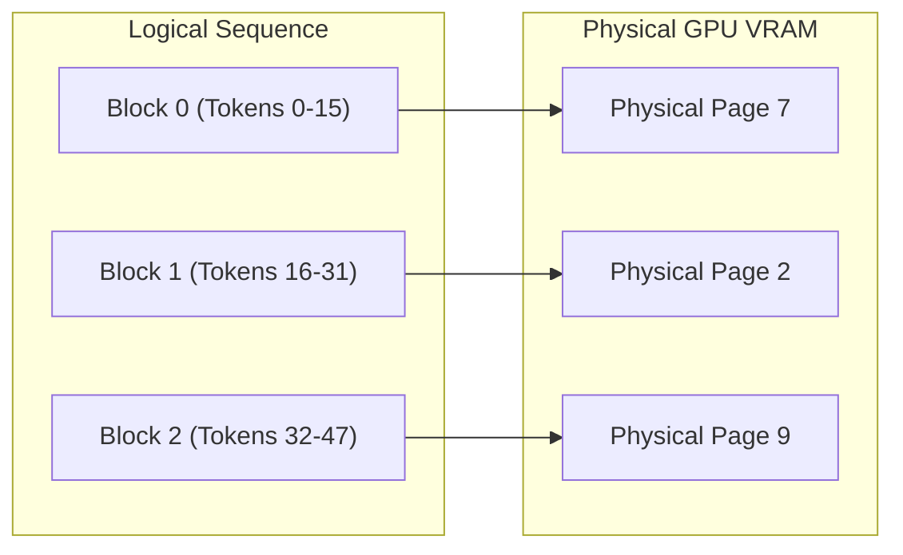

# Key-Value (KV) Cache Memory Optimization Guide

During auto-regressive text generation, caching Key and Value tensors across attention layers avoids recomputing attention matrices for past tokens. However, KV-cache memory scales linearly with sequence length and batch size, rapidly consuming all available GPU VRAM.

$$\text{Memory}_{\text{KV}} = 2 \times 2 \times n_{\text{layers}} \times n_{\text{heads}} \times d_{\text{head}} \times L_{\text{seq}} \times B_{\text{batch}} \times \text{bytes\_per\_element}$$

For a 70B parameter model at 8k sequence length and batch size 16, vanilla KV-cache consumes **over 40 GB of VRAM**.

---

## 🚀 1. Paged KV-Cache (Zero Fragmentation)

Inspired by OS virtual memory paging, Paged KV-Cache divides KV-tensors into fixed-size blocks (e.g., 16 tokens per block) allocated in non-contiguous physical GPU memory:



### Benefits:
- Reduces memory waste from 70% to under 4%.
- Allows zero-copy prompt sharing (prefix caching) for shared system prompts.

```yaml
inference:
  kv_cache:
    backend: "paged"
    block_size: 16
    max_gpu_memory_gb: 12.0
```

---

## ✂️ 2. SnapKV: Observation Window Compression

SnapKV identifies that only a fraction of historical KV tokens contribute significantly to attention weights. It uses an **Observation Window** (e.g., the last 32 tokens) to vote on which past KV states to retain:

```python
from papers.snap_kv import SnapKVCompressor

# Retain only top 25% most salient KV states
compressor = SnapKVCompressor(window_size=32, compression_ratio=0.25)
compressed_kv = compressor.compress(raw_kv_states, attention_scores)
```

- **Result**: Reduces KV-cache footprint by **3.8x** with < 0.1 perplexity delta.

---

## 🗜️ 3. Adaptive KV Quantization (INT8 / FP8 / INT4)

Dynamically compresses KV tensor representations without degrading reasoning accuracy:

| Quantization Mode | Memory Saving | Accuracy Impact | Hardware Requirement |
| :--- | :--- | :--- | :--- |
| **FP8 (E4M3)** | 2.0x | 0.0% Degradation | NVIDIA Ada Lovelace / Hopper |
| **INT8 Per-Token** | 2.0x | < 0.05% Degradation | All Modern NVIDIA GPUs |
| **INT4 Group-Wise** | 4.0x | Minimal (Requires Outlier Protection) | Ampere / Hopper |

```yaml
inference:
  kv_cache:
    quantization: "int8"
    group_size: 128
```
