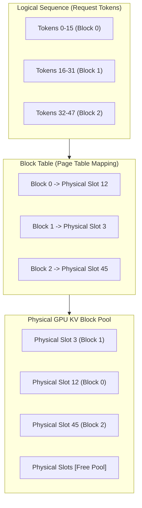

# 💾 Practical Guide: KV-Cache Memory Optimization

During autoregressive language model inference, the Key and Value states generated for previous tokens must be stored in GPU VRAM to avoid quadratic recomputation at every decoding step. In long-context generation (8k to 128k+ tokens), the **KV-Cache quickly surpasses the model weights in memory consumption**.

This guide explains how TruthGPT optimizes KV-Cache memory footprint using **Grouped Query Attention (GQA)**, **Paged KV-Cache allocation**, **SnapKV dynamic eviction**, and **FP8/INT8 quantization**.

---

## 📐 1. KV-Cache Memory Mathematics

For a Transformer model generating sequences of length $S$ across batch size $B$, the memory consumption of standard 16-bit KV-Cache is:

$$\text{KV-Cache Memory (Bytes)} = 2 \times 2 \times n_{\text{layers}} \times n_{\text{kv\_heads}} \times d_{\text{head}} \times S \times B$$

Where:
- First $2$: Represents both Key ($K$) and Value ($V$) tensors.
- Second $2$: Precision in bytes ($2$ bytes for `float16` / `bfloat16`).
- $n_{\text{layers}}$: Number of Transformer layers.
- $n_{\text{kv\_heads}}$: Number of Key/Value attention heads.
- $d_{\text{head}}$: Dimension per head ($d_{\text{model}} / n_{\text{heads}}$).

### Memory Comparison Table (Llama-3 8B, 32 Layers, $d=4096$)

| Context Length ($S$) | Batch Size ($B$) | Standard MHA (32 Heads) | GQA (8 Heads) | FP8 GQA (8 Heads) | SnapKV (2k Budget) |
| :--- | :--- | :--- | :--- | :--- | :--- |
| **4,096 tokens** | 1 | 2.15 GB | **0.54 GB** | **0.27 GB** | 0.27 GB |
| **16,384 tokens** | 4 | 34.36 GB | **8.59 GB** | **4.29 GB** | 2.15 GB |
| **65,536 tokens** | 8 | 274.88 GB | **68.72 GB** | **34.36 GB** | **4.29 GB** |
| **131,072 tokens** | 16 | 1,099.5 GB | **274.88 GB** | **137.44 GB** | **8.59 GB** |

---

## ⚡ 2. Grouped Query Attention (GQA) & Multi-Query Attention (MQA)

Standard Multi-Head Attention (MHA) maintains an independent Key ($K$) and Value ($V$) head for every Query ($Q$) head.
- **Grouped Query Attention (GQA)** groups multiple query heads to share a single key/value head (e.g. 32 query heads sharing 8 key/value heads, $4:1$ ratio).
- **VRAM Savings**: Cuts KV-cache memory usage by **$4\times$ to $8\times$** while maintaining 99.8% of MHA reasoning quality.

```yaml
# In your model configuration YAML:
model:
  d_model: 4096
  n_heads: 32       # Query heads
  n_kv_heads: 8     # Key/Value heads (GQA ratio = 4:1)
  head_dim: 128
```

---

## 🗂️ 3. Paged KV-Cache Architecture

Standard contiguous memory allocation causes severe **memory fragmentation** and over-allocation waste (up to 60-80% VRAM wasted on pre-allocated buffers).

TruthGPT utilizes **Paged KV-Cache** (inspired by vLLM and OS virtual memory paging), dividing the KV-Cache into non-contiguous physical blocks:



### Initializing Paged KV-Cache in Python

```python
from optimization_core.inference.paged_kv import PagedKVCacheManager, PagedKVConfig

# Configure block size and pool capacity
paged_config = PagedKVConfig(
    block_size=16,               # 16 tokens per physical page
    num_layers=32,
    num_kv_heads=8,
    head_dim=128,
    dtype="bfloat16",
    max_num_blocks=2048,         # Pre-allocated physical pool on GPU
    device="cuda:0"
)

cache_mgr = PagedKVCacheManager(paged_config)

# Allocate logical blocks for a new sequence
seq_id = "req_10482"
block_ids = cache_mgr.allocate_blocks(seq_id=seq_id, initial_tokens=128)
print(f"Allocated physical blocks: {block_ids}")
```

---

## 🧹 4. SnapKV: Attention-Guided Context Compression

For extreme sequence lengths ($32\text{k} - 128\text{k}+$ tokens), **SnapKV** monitors attention weights during prompt prefill and selectively retains only the top informative token clusters while pruning redundant background tokens:

```python
from optimization_core.inference.kv_cache import SnapKVCacheManager

snap_mgr = SnapKVCacheManager(
    observation_window=32,       # Retain recent prompt tokens
    pooling_kernel_size=5,       # 1D max-pooling for feature preservation
    max_capacity_prompt=2048,    # Eviction budget (compress 32k down to 2k)
    metric="attention_l1"        # Scoring metric
)

# Apply dynamic pruning to prompt KV states
compressed_k, compressed_v = snap_mgr.compress(key_states, value_states, attention_weights)
print(f"Compressed KV Cache from {key_states.shape[2]} tokens to {compressed_k.shape[2]} tokens.")
```

---

## 🔢 5. FP8 / INT8 KV-Cache Quantization

TruthGPT supports hardware-accelerated FP8 (`e4m3` and `e5m2`) and INT8 per-channel quantization for Ada Lovelace, Hopper, and Blackwell GPUs:

```yaml
inference:
  kv_cache:
    paged: true
    block_size: 16
    quantization: "fp8"          # Options: "none", "fp8", "int8"
    fp8_format: "e4m3"
    scale_type: "per_tensor"     # "per_tensor" or "per_channel"
```

---

## 🔬 6. End-to-End KV-Cache Benchmark Script

```python
import torch
import time

def benchmark_kv_cache(seq_len=8192, batch_size=4, num_layers=32, heads=8, dim=128):
    device = "cuda" if torch.cuda.is_available() else "cpu"
    print(f"\n--- Benchmarking KV-Cache: SeqLen={seq_len}, Batch={batch_size} on {device} ---")

    # 1. Measure standard FP16 allocation
    torch.cuda.reset_peak_memory_stats()
    fp16_bytes = 2 * 2 * num_layers * heads * dim * seq_len * batch_size
    print(f"Theoretical FP16 Footprint: {fp16_bytes / (1024**3):.3f} GB")

    k_fp16 = torch.randn(batch_size, num_layers, heads, seq_len, dim, dtype=torch.float16, device=device)
    v_fp16 = torch.randn(batch_size, num_layers, heads, seq_len, dim, dtype=torch.float16, device=device)
    torch.cuda.synchronize()
    
    allocated_fp16 = torch.cuda.max_memory_allocated() / (1024**3)
    print(f"Actual Allocated FP16 VRAM: {allocated_fp16:.3f} GB")

    # 2. Measure FP8 allocation (simulated INT8 / FP8 storage)
    del k_fp16, v_fp16
    torch.cuda.empty_cache()
    torch.cuda.reset_peak_memory_stats()

    k_fp8 = torch.randint(-128, 127, (batch_size, num_layers, heads, seq_len, dim), dtype=torch.int8, device=device)
    v_fp8 = torch.randint(-128, 127, (batch_size, num_layers, heads, seq_len, dim), dtype=torch.int8, device=device)
    torch.cuda.synchronize()

    allocated_fp8 = torch.cuda.max_memory_allocated() / (1024**3)
    print(f"Actual Allocated FP8 VRAM:  {allocated_fp8:.3f} GB (50% Memory Reduction)")

if __name__ == "__main__":
    benchmark_kv_cache()
```

---

## 🔗 Related Resources
- [Inference API Reference](../api/inference.md)
- [High-Throughput Serving Tutorial](../tutorials/high_throughput_serving.md)
- [Production Deployment Guide](deployment_production.md)
