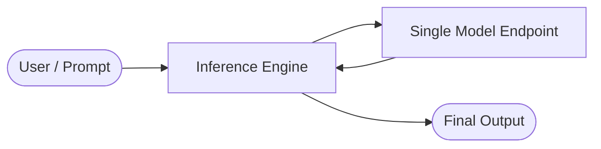
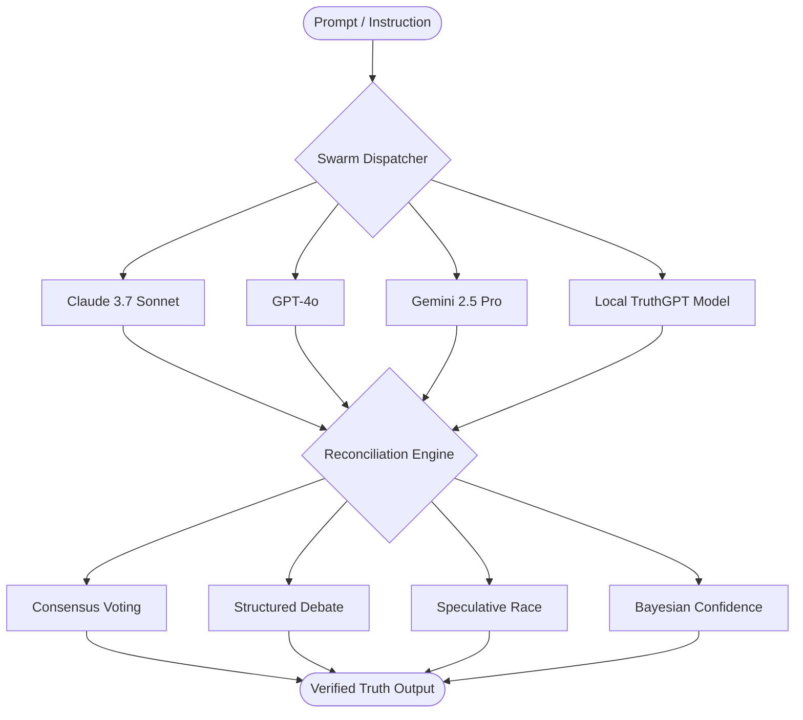
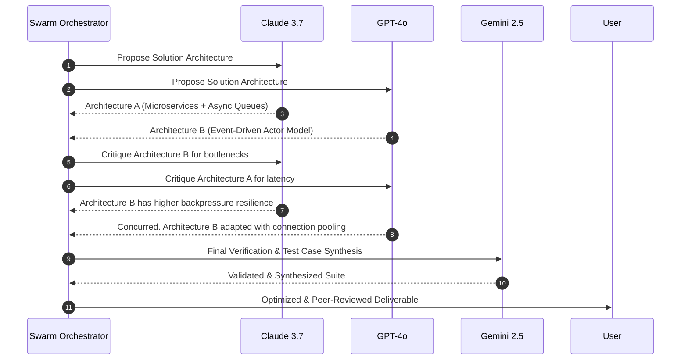

# 🐝 Swarm Ensemble vs. Single-Model Inference Guide

This guide provides a comprehensive architectural and practical comparison between executing tasks with a single foundation model versus orchestrating a multi-model **Swarm Ensemble** in TruthGPT.

---

## 📊 Quick Comparison Matrix

| Capability / Metric | Single Model (e.g. Claude 3.7 / GPT-4o alone) | TruthGPT Swarm Ensemble (Multi-Model Consensus) |
| :--- | :--- | :--- |
| **Reasoning Accuracy** | High (subject to single model blindspots) | **Maximum** (multi-agent cross-verification) |
| **Hallucination Rate** | Baseline (no independent external check) | **Near-Zero** (filtered out via consensus & debate) |
| **Provider Redundancy** | None (Single Point of Failure if API is down) | **Complete** (Automatic fallback & failover) |
| **Latency** | Dependent on single provider queue | **Optimizable via Race Strategy** (fastest response wins) |
| **Cognitive Diversity** | Uniform (single tokenizer & training bias) | **Heterogeneous** (combines strengths of distinct architectures) |
| **Compute / Token Cost** | Baseline ($1\times$) | Variable ($1.5\times$ to $3\times$, dynamic budgeting) |

---

## 🏛️ 1. Single Model Execution (Base Mode)

In **Base Mode**, TruthGPT routes a user query or agent prompt directly to a single selected LLM backend (e.g., Anthropic Claude, OpenAI GPT-4, Google Gemini, or a local fine-tuned Hugging Face checkpoint).



### When to Use Single-Model Mode
> [!TIP]
> **Recommended For:**
> - Repetitive, well-defined coding snippets or boilerplate generation.
> - High-frequency streaming chats where ultra-low token cost is paramount.
> - Fast initial exploration and prototyping drafts.

### Limitations & Failure Modes
1. **Single Point of Failure:** If the provider experiences service degradation, rate limits, or outage spikes, the pipeline halts.
2. **Unchecked Hallucinations:** When a single model generates syntactically plausible but logically invalid code or synthetic data, there is no external peer model to detect the error before execution.
3. **Architectural Bias:** Individual models possess idiosyncratic training priors (e.g., preference for specific library versions, over-confidence on false premises).

---

## 🌟 2. Swarm Ensemble Orchestration (Multi-Model Mode)

In **Swarm Ensemble Mode**, TruthGPT fans out prompts across multiple heterogeneous models simultaneously and invokes intelligent aggregation protocols.



---

## 🚀 3. Swarm Ensemble Reconciliation Strategies

TruthGPT features four primary reconciliation strategies configured per workflow:

### A. Consensus & Majority Voting (Hallucination Suppression)
Independent responses are generated across $N$ models. A semantic embedding distance and AST verification matrix calculates pairwise similarity:

$$S(R_i, R_j) = \alpha \cdot \text{CosineSim}(E_i, E_j) + \beta \cdot \text{ASTMatch}(T_i, T_j)$$

- If 2 out of 3 models converge on identical code logic, diverging outlier hallucinations are discarded automatically.
- Essential for zero-defect production code and mathematical derivations.

### B. Multi-Round Structured Debate Protocol
When models produce diverging architectures or solutions, TruthGPT initiates an autonomous multi-round critique cycle:



### C. Speculative Race (Latency Optimization)
Requests are dispatched simultaneously across $K$ endpoints. TruthGPT streams or yields the first valid, fully validated response that completes execution:
- Eliminates tail latency spikes from loaded provider APIs.
- Protects 24/7 autonomous agents from API hang-ups.

### D. Bayesian Self-Certainty & Weighted Confidence
TruthGPT extracts token log-probability margins, entropy scores, and epistemic certainty from each provider:

$$W_m = \frac{\exp(-\bar{H}_m / \tau)}{\sum_{j=1}^M \exp(-\bar{H}_j / \tau)}$$

Where $\bar{H}_m$ is the mean token entropy of model $m$ across key decision points. Models demonstrating high certainty and chain-of-thought grounding are weighted dynamically.

---

## 💻 4. Python Implementation Recipes

### Example 1: Creating a Swarm Ensemble with Consensus

```python
from agents.framework.orchestrator import SwarmOrchestrator, EnsembleConfig
from agents.framework.engines import EngineRegistry

# Configure Swarm with 3 heterogeneous engines
ensemble_config = EnsembleConfig(
    strategy="consensus", # "consensus" | "debate" | "race" | "bayesian"
    models=["claude-3-7-sonnet", "gpt-4o", "gemini-2.5-pro"],
    similarity_threshold=0.85,
    min_agreement=2,
    max_debate_rounds=3
)

orchestrator = SwarmOrchestrator(config=ensemble_config)

# Execute critical optimization task
response = orchestrator.execute(
    task="Implement a lock-free ring buffer in C++ with memory barriers and benchmark it.",
    context={"performance_critical": True}
)

print(f"Strategy Used: {response.strategy_used}")
print(f"Consensus Agreement: {response.agreement_score * 100:.1f}%")
print(f"Validated Code:\n{response.final_output}")
```

---

### Example 2: Adaptive Swarm with Cost & Accuracy Routing

```python
from agents.framework.routing import DynamicTopologyRouter
from agents.framework.models import TaskComplexity

router = DynamicTopologyRouter()

def run_adaptive_query(prompt: str):
    # Assess task complexity
    complexity = router.assess_complexity(prompt)
    
    if complexity == TaskComplexity.CRITICAL:
        # Full multi-model debate ensemble
        return orchestrator.execute_debate(prompt, rounds=2)
    elif complexity == TaskComplexity.STANDARD:
        # Speculative race between two fast models
        return orchestrator.execute_race(prompt, models=["claude-3-5-haiku", "gpt-4o-mini"])
    else:
        # Single model fast-path
        return orchestrator.execute_single(prompt, model="gpt-4o-mini")
```

---

## 💡 Summary & Best Practices

1. **Use Single Model** for rapid prototyping, continuous test log summaries, and non-critical data generation where API token budget is constrained.
2. **Use Swarm Ensemble** for architecture design, refactoring, security audits, formal mathematical proofs, and automated deployment scripts where a silent failure or hallucination causes system downtime.
3. **Combine with Dynamic Routing** to achieve optimal cost-per-query while maintaining $99.9\%+$ logical accuracy across your organization.
