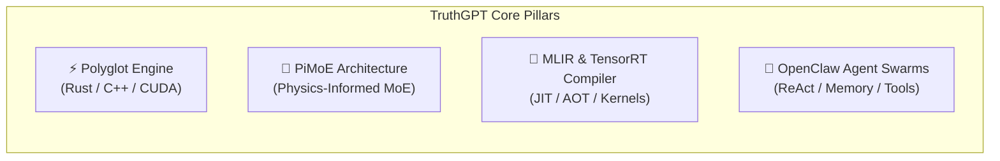

# ⚡ TruthGPT Optimization Core Documentation Hub

Welcome to the **TruthGPT Optimization Core** enterprise documentation suite. TruthGPT is a modular, ultra-high-performance deep learning ecosystem combining polyglot hardware acceleration, physics-informed mixture of experts (PiMoE), MLIR/JIT graph compilation, and autonomous OpenClaw agent swarms.

---

## 🧭 Navigation Matrix by Role

<div class="grid cards" markdown>

-   :material-flash: **[ML Engineers & Researchers](getting_started/quickstart_training.md)**
    -   [5-Minute Training Quickstart](getting_started/quickstart_training.md)
    -   [Optimization & Performance Tuning](guides/optimization_tuning.md)
    -   [Distributed Training (FSDP / ZeRO)](guides/distributed_training.md)
    -   [LoRA & QLoRA Fine-Tuning Tutorial](tutorials/lora_finetuning.md)
    -   [SOTA Research Papers Catalog](api/papers.md)

-   :material-robot: **[Agent & App Developers](getting_started/quickstart_agents.md)**
    -   [OpenClaw Agent Quickstart](getting_started/quickstart_agents.md)
    -   [Swarm Ensemble vs Single Model](guides/swarm_ensemble_vs_single_model.md)
    -   [Custom Tools & Specialized Agents](guides/custom_agent_development.md)
    -   [Graph Orchestrator & State Machines](architecture/agent_framework.md)
    -   [OpenClaw Agents SDK API](api/agents.md)
    -   [Autonomous Research Swarms Recipe](examples/agent_swarms.md)

-   :material-cpu-64-bit: **[Systems & Compiler Engineers](getting_started/quickstart_compiler.md)**
    -   [Compiler & Acceleration Quickstart](getting_started/quickstart_compiler.md)
    -   [Polyglot Core Architecture (Rust / C++)](architecture/polyglot_core.md)
    -   [Custom CUDA & Triton Kernels](guides/compiler_and_kernels.md)
    -   [KV-Cache Memory Optimization](guides/kv_cache_optimization.md)
    -   [Compiler Runtime API](api/compiler.md)

-   :material-server: **[DevOps & Production Teams](guides/deployment_production.md)**
    -   [Cross-Platform Installation Guide](getting_started/installation.md)
    -   [Production Serving & REST API](guides/deployment_production.md)
    -   [Prometheus Metrics & Diagnostics](getting_started/health_and_diagnostics.md)
    -   [Troubleshooting & Diagnostics](guides/troubleshooting.md)
    -   [Centro de Documentación en Español](spanish/index.md)
    -   [Historical Records & Archive](archive/index.md)

</div>

---

## 🌟 Architectural Highlights



| Feature | Description | Reference Guide |
| :--- | :--- | :--- |
| **Polyglot Acceleration** | Zero-copy tensor sharing between PyTorch, Rust, and C++ for minimal memory allocation latency. | [Polyglot Core](architecture/polyglot_core.md) |
| **PiMoE (Physics MoE)** | Sparse Mixture of Experts regularized by Hamiltonian conservation laws to eliminate expert collapse. | [PiMoE Architecture](architecture/pimoe.md) |
| **Multi-Stage Compiler** | Graph lowering through MLIR dialects, automatic Triton autotuning, and TensorRT compilation. | [Compiler Runtime](architecture/compiler_runtime.md) |
| **OpenClaw Swarms** | Autonomous ReAct agent ecosystem with vector episodic memory, auto-reflexion, and multi-chat webhooks. | [Agent Framework](architecture/agent_framework.md) |
| **Swarm Ensemble & Debate** | Multi-model consensus voting, structured debate, and speculative race for near-zero hallucination. | [Swarm Ensemble Guide](guides/swarm_ensemble_vs_single_model.md) |
| **KV-Cache Optimization** | PagedAttention, SnapKV dynamic context eviction, GQA, and FP8 quantization. | [KV-Cache Optimization](guides/kv_cache_optimization.md) |
| **Unified Config System** | Strongly typed YAML/dataclass configurations with automated cross-field validation rules. | [Configuration Guide](getting_started/configuration.md) |

---

## 📦 Quick Navigation Tree

```
docs/
├── getting_started/         # Installation, 5-minute quickstarts, health checks & configs
├── architecture/            # Deep-dive system design, models, data pipeline & polyglot
├── guides/                  # In-depth optimization, distributed, & deployment guides
├── tutorials/               # Step-by-step hands-on tutorials (LoRA, serving, agents)
├── api/                     # Full Python & Native C-FFI API references
├── examples/                # Runnable recipes & benchmark scripts
├── spanish/                 # Complete Spanish documentation suite & guides
└── archive/                 # Historical evolution, refactoring logs & proposals
```
