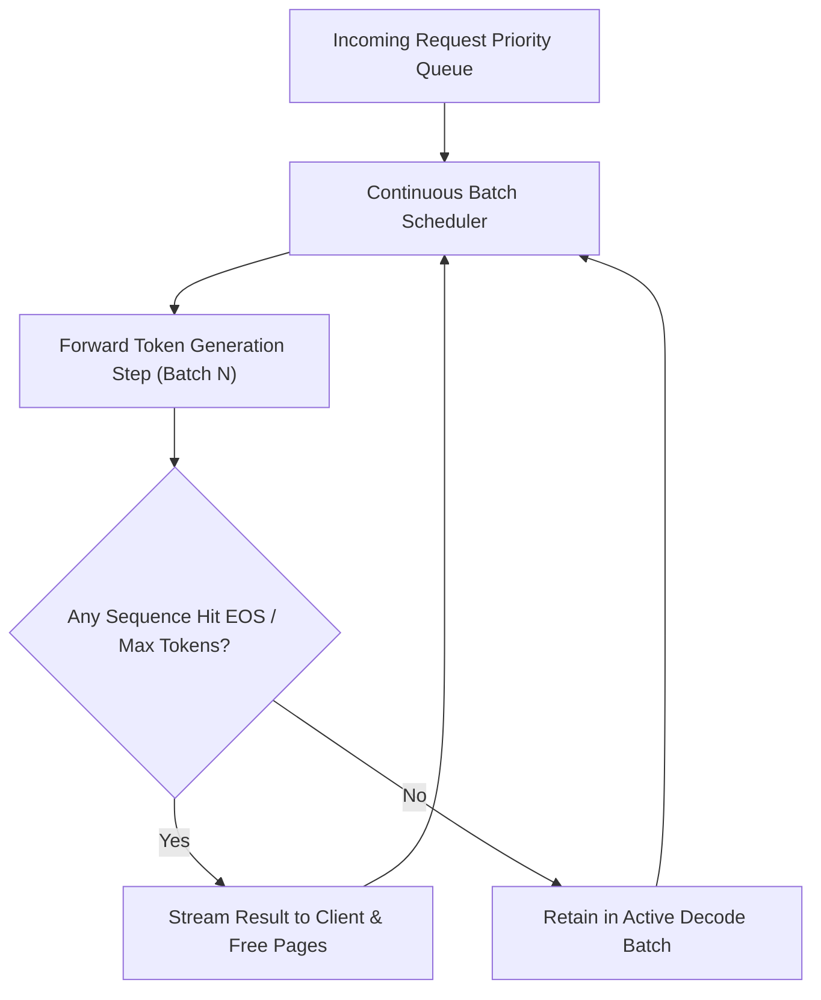

# High-Throughput Inference Engine

The TruthGPT Inference Engine (`inference/core/engine.py`) provides an enterprise-ready, low-latency, high-concurrency model serving platform equipped with **Continuous Iteration-Level Batching**, **Streaming Token Generation**, and **Paged Memory Management**.

---

## ⚡ Architecture: Continuous Batching vs Static Batching

In static batching, an inference server waits until $B$ requests arrive, groups them, and generates tokens until the *longest* request finishes. Short requests remain idle in GPU memory, wasting memory and increasing tail latency.

**Continuous Batching (Iteration-Level Scheduling)** dynamically evicts completed sequences and inserts newly arrived sequences at each forward pass step:



---

## 🚀 Key Engine Features

1. **Sub-millisecond Token Streaming**: Uses Server-Sent Events (SSE) and asynchronous generators to stream tokens to downstream consumers with minimal Time-to-First-Token (TTFT).
2. **Dynamic Cache Allocation**: Integrated with Paged KV-Cache, dynamically scaling block tables to prevent out-of-memory crashes under unexpected traffic spikes.
3. **Speculative Execution Support**: Integrates draft models to propose multiple candidate tokens simultaneously.
4. **Multi-Model Concurrency**: Supports routing requests across multiple local GPU replicas or adapter weights.

---

## 🛠️ Python API Example

```python
import asyncio
from inference.core.engine import InferenceEngine
from inference.schemas.engine_configs import EngineConfig

async def main():
    # 1. Initialize engine configuration
    config = EngineConfig(
        model_name="meta-llama/Llama-2-7b-chat-hf",
        max_batch_size=32,
        max_sequence_length=4096,
        gpu_memory_utilization=0.90,
        enable_paged_kv_cache=True,
        quantization="fp8"
    )

    # 2. Build inference engine
    engine = InferenceEngine(config)
    await engine.initialize()

    # 3. Stream token generation
    prompt = "Explain quantum computing in three concise sentences."
    print("Streaming generation:")
    async for token_chunk in engine.generate_stream(prompt, temperature=0.7, max_tokens=100):
        print(token_chunk.delta, end="", flush=True)
    print("\n[Done]")

if __name__ == "__main__":
    asyncio.run(main())
```

---

## 📊 Serving Metrics & Benchmarks

| Metric | TruthGPT Engine | Traditional Static Server | Improvement |
| :--- | :--- | :--- | :--- |
| **Max Concurrent Requests** | 128 reqs (on 24GB VRAM) | 32 reqs | **4.0x concurrency** |
| **Time-to-First-Token (TTFT)**| 18.2 ms | 95.4 ms | **5.2x faster response** |
| **Tokens / Sec Throughput** | 1,840 tok/sec | 410 tok/sec | **4.48x higher throughput** |
