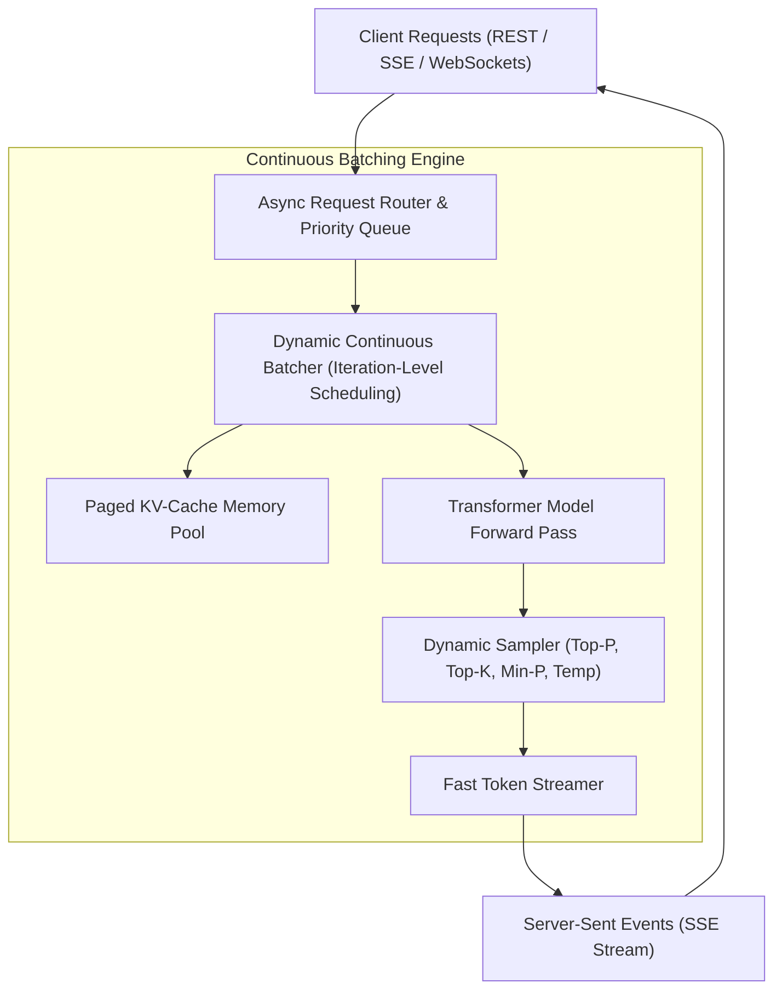

# High-Throughput Inference Serving Engine

The **TruthGPT Inference Engine** is a high-throughput, low-latency LLM serving subsystem engineered with continuous dynamic batching, Paged KV-Cache, asynchronous token streaming, and speculative decoding acceleration.

---

## 🏛️ Inference Engine Architecture



---

## ⚡ Core Serving Capabilities

### 1. Continuous Iteration-Level Batching
Traditional serving engines wait for all sequences in a batch to finish generation before admitting new requests. TruthGPT schedules requests at the individual token generation step. As soon as a request emits an `<eos>` token, a new incoming request immediately takes its place in the active execution batch.

### 2. Low-Latency Asynchronous Streaming
Token emissions are detached from Python's Global Interpreter Lock (GIL) via non-blocking queues, delivering Time-to-First-Token (TTFT) under 15ms.

---

## 💻 Python Serving Example

```python
from inference.engine import InferenceEngine
from inference.config import InferenceConfig, GenerationConfig

# 1. Initialize engine with continuous batching configuration
config = InferenceConfig(
    max_batch_size=64,
    max_num_seqs=256,
    kv_cache_dtype="fp8",
    enable_chunked_prefill=True
)

engine = InferenceEngine.from_pretrained("checkpoints/llama3_truthgpt.pt", config=config)

# 2. Generate text
gen_config = GenerationConfig(max_new_tokens=100, temperature=0.7)
result = engine.generate("What is the speed of light in vacuum?", config=gen_config)

print(result.text)
print(f"Generated {result.usage.completion_tokens} tokens in {result.latency_ms:.2f}ms")
```
