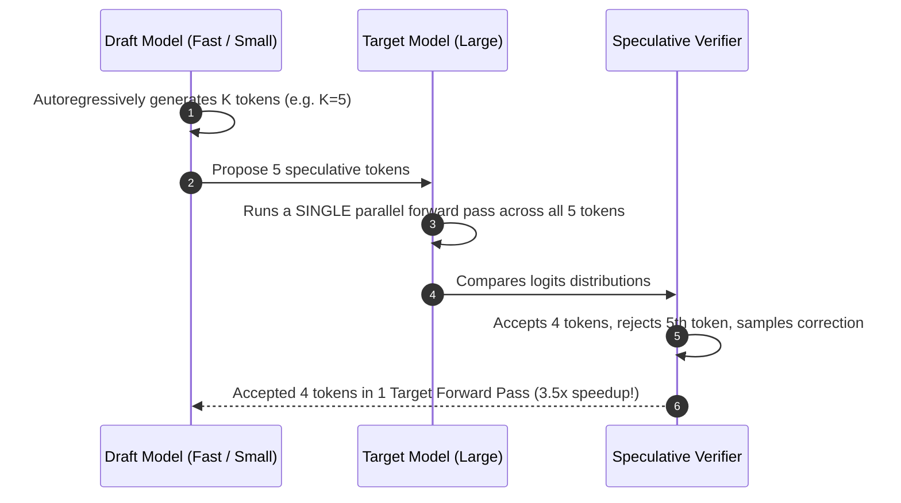

# Paged KV-Cache & Speculative Decoding

The **TruthGPT Inference Optimization Subsystem** (`inference/kv_cache.py`, `inference/speculative.py`) dramatically increases generation throughput and reduces memory footprint via **Paged KV-Cache** and **Speculative Decoding**.

---

## 💾 Paged KV-Cache & SnapKV Eviction

Standard key-value caching allocates contiguous memory chunks per request based on `max_seq_len` (e.g. 8192 tokens), causing severe memory fragmentation and wasting up to 60-80% of GPU VRAM.

### Paged Memory Management
- TruthGPT partitions the KV-Cache into small physical blocks (typically 16 tokens per block).
- A virtual memory page table maps logical sequence token indices to physical block IDs on GPU VRAM.
- **Result**: Zero internal memory fragmentation, enabling up to **$4\times$ larger concurrent serving batch sizes**.

### SnapKV Dynamic Pruning
- Automatically monitors attention scores in early prompt layers.
- Safely evicts up to 80% of low-impact KV-cache positions for long-context sequences without degradation in reasoning accuracy.

---

## ⚡ Speculative Decoding

Speculative decoding pairs a small, fast "draft" model (e.g., LLaMA-68M) with a large target model (e.g., LLaMA-70B):



### Enabling Speculative Decoding

```bash
python -m inference.server \
    --model meta-llama/Llama-2-70b \
    --speculative-draft meta-llama/Llama-2-7b \
    --num-speculative-tokens 5
```
