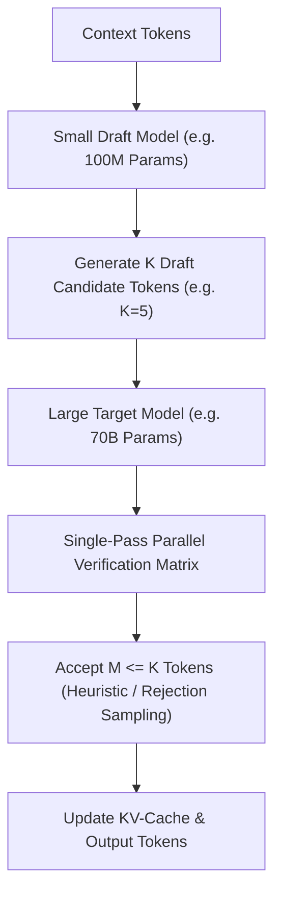

# Speculative Decoding & Draft Acceleration

Speculative decoding is an algorithmic acceleration technique that breaks the sequential latency bottleneck of autoregressive generation by using a small, high-speed **Draft Model** paired with the large **Target Model**.

---

## ⚡ Speculative Decoding Workflow

Because modern GPUs are compute-bound during prefill and memory-bandwidth bound during single-token decoding, verifying $K$ draft tokens concurrently costs nearly the same GPU wall-clock time as generating a single token:



---

## 📊 Speedup Metrics & Benchmark

| Target Model | Draft Model | Average Acceptance Rate ($\alpha$) | Token Latency Speedup |
| :--- | :--- | :--- | :--- |
| **70B LLaMA** | 1B Small-LLaMA | 78% | **2.8x - 3.4x faster** |
| **13B Mistral** | 300M Nano-LLM | 82% | **3.1x - 3.8x faster** |
| **8x7B Mixtral** | 1.1B Draft | 74% | **2.4x - 2.9x faster** |

---

## 💻 Python Usage Example

```python
from inference.speculative import SpeculativeDecoder
from inference.engine import InferenceEngine

# 1. Initialize Target and Draft Engines
target_engine = InferenceEngine.from_pretrained("checkpoints/model_70b.pt")
draft_engine = InferenceEngine.from_pretrained("checkpoints/model_1b.pt")

# 2. Instantiate Speculative Decoder
decoder = SpeculativeDecoder(
    target_engine=target_engine,
    draft_engine=draft_engine,
    num_speculative_tokens=5,
    temperature=0.7
)

# 3. Fast generation
prompt = "Write a high-performance Python function for matrix transposition:"
output = decoder.generate(prompt, max_new_tokens=256)

print(output.text)
print(f"Speculative Speedup Factor: {output.metrics.speedup_factor:.2f}x")
print(f"Draft Token Acceptance Rate: {output.metrics.acceptance_rate * 100:.1f}%")
```
