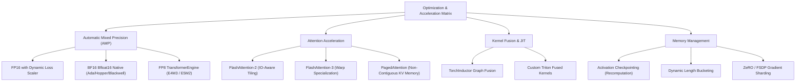

# Hardware Acceleration & Deep Optimization Guide

TruthGPT Optimization Core integrates state-of-the-art computational techniques to maximize GPU FLOP utilization, reduce memory bandwidth bottlenecks, and accelerate both training and inference.

---

## ⚡ Optimization Techniques Overview



---

## 1. Automatic Mixed Precision (AMP)

Modern NVIDIA Tensor Cores execute low-precision matrix multiplications at dramatic speedups compared to FP32:

| Precision Format | Bits | Dynamic Range | Relative Compute Speed | Best Target Hardware |
| :--- | :--- | :--- | :--- | :--- |
| **FP32** | 32 | $10^{\pm 38}$ | 1.0x (Baseline) | CPU / Debugging |
| **FP16** | 16 | $10^{\pm 5}$ | ~2.5x - 3.5x | Turing / Ampere |
| **BF16** | 16 | $10^{\pm 38}$ | ~3.0x - 4.0x | Ampere / Ada / Hopper |
| **FP8 (E4M3/E5M2)** | 8 | $10^{\pm 2} / 10^{\pm 4}$ | ~6.0x - 8.0x | Hopper / Blackwell |

### Enabling AMP in TruthGPT

```python
# In TrainerConfig or YAML preset:
config = TrainerConfig(
    use_amp=True,
    amp_dtype="bfloat16" # Options: 'bfloat16', 'float16', 'fp8'
)
```

---

## 2. FlashAttention-2 & FlashAttention-3

Standard PyTorch attention materializes the full $N \times N$ attention matrix in GPU HBM (High-Bandwidth Memory), causing $O(N^2)$ memory scaling and high memory traffic.

FlashAttention tiles Query, Key, and Value blocks directly into fast GPU SRAM (on-chip memory), avoiding intermediate HBM read/writes:

$$\text{Memory Overhead}: O(N^2) \longrightarrow O(N)$$

TruthGPT automatically dispatches to the highest-performing available backend:

```python
from models.modules.attention import FlashAttentionWrapper

# Auto-detects and uses FlashAttention-2 if CUDA toolkit is present
attn = FlashAttentionWrapper(d_model=1024, num_heads=16)
```

---

## 3. Activation Checkpointing (Gradient Recomputation)

For models exceeding GPU VRAM capacity, activation checkpointing discards intermediate forward activations from memory and recomputes them on the fly during the backward pass:

- **Memory Saved**: Up to **60-70%** reduction in activation memory.
- **Compute Overhead**: Only ~20% increase in backward FLOPs.

```python
config = TrainerConfig(
    gradient_checkpointing=True
)
```
