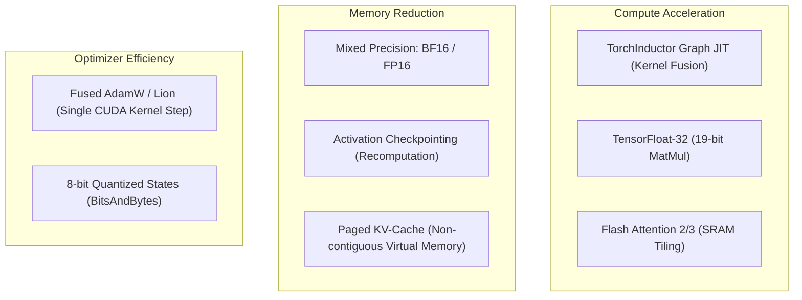

# Hardware Acceleration & Deep Optimization Guide

TruthGPT Optimization Core integrates state-of-the-art computational techniques to maximize GPU FLOPs utilization (MFU) and minimize VRAM overhead across modern accelerators.

---

## 🚀 Optimization Techniques Overview



---

## ⚡ 1. Torch.compile & TorchInductor

`torch.compile` converts PyTorch eager mode into optimized Triton CUDA kernels, fusing consecutive pointwise and reduction operations to eliminate kernel launch latency and memory bandwidth round-trips.

### Compile Modes:
- `default`: Fast compilation; fuses basic kernels and eliminates Python interpreter overhead.
- `reduce-overhead`: Utilizes CUDA Graphs to record and replay kernel execution without CPU-GPU synchronization. Ideal for small batch sizes and low-latency inference.
- `max-autotune`: Evaluates multiple Triton kernel tile sizes and schedules for the exact GPU architecture. Takes longer to compile at startup but achieves peak runtime speed.

### YAML Configuration:
```yaml
training:
  torch_compile: true
  compile_mode: "default"  # default | reduce-overhead | max-autotune
```

---

## 💡 2. TensorFloat-32 (TF32)

NVIDIA Ampere, Ada Lovelace, and Hopper architectures include specialized TF32 Tensor Cores that compute FP32 matrix multiplications with 19-bit precision (8-bit exponent, 10-bit mantissa) at up to **8x higher throughput** than standard FP32 math.

TruthGPT enables TF32 automatically for supported hardware:
```python
import torch
torch.backends.cuda.matmul.allow_tf32 = True
torch.backends.cudnn.allow_tf32 = True
```

---

## 🌊 3. Flash Attention 2 & 3

Standard attention calculates $S = Q K^T / \sqrt{d}$, materializes an $N \times N$ attention matrix in GPU High-Bandwidth Memory (HBM), applies Softmax, and multiplies by $V$. This requires $O(N^2)$ memory and is heavily memory-bandwidth bound.

**Flash Attention** breaks $Q, K, V$ into small tiles that fit entirely inside high-speed GPU on-chip SRAM (192KB+ per Streaming Multiprocessor), computing attention and online softmax incrementally without writing $N \times N$ intermediates to HBM.

| Attention Mechanism | Memory Complexity | Compute Boundness | Context Length Scaling |
| :--- | :--- | :--- | :--- |
| **Standard Attention** | $O(N^2)$ Quadratic | Memory Bandwidth Bound | Limited (~2k - 4k) |
| **Flash Attention 2** | $O(N)$ Linear | Math Compute Bound | Extended (32k - 128k+) |
| **Flash Attention 3 (Hopper)** | $O(N)$ Linear + FP8 Asynchronous WGMMA | Peak Tensor Core MFU | Ultra Extended (256k+) |

---

## 🛡️ 4. Gradient Activation Checkpointing

To compute backpropagation gradients, deep networks normally retain all intermediate forward activations in VRAM. For a 7B model at batch size 8 and sequence length 4096, activation memory easily exceeds 40 GB.

**Gradient Checkpointing** discards intermediate activations during the forward pass and recomputes them on-the-fly during the backward pass:
- **VRAM Savings**: Up to **70%–80% memory reduction**.
- **Compute Overhead**: Only ~20% additional FLOPs during backward pass.
- **Net Result**: Allows 3x–4x larger batch sizes, which increases GPU utilization and offsets recomputation cost.

```yaml
model:
  gradient_checkpointing: true
```

---

## 📈 Performance Summary Matrix

| Optimization Combo | Training Throughput | VRAM Consumption | Max Sequence Length |
| :--- | :--- | :--- | :--- |
| Eager FP32 Baseline | 1,200 tok/sec | 22.4 GB | 1,024 tokens |
| + BF16 Mixed Precision | 2,800 tok/sec | 12.8 GB | 2,048 tokens |
| + Flash Attention 2 | 5,900 tok/sec | 8.2 GB | 8,192 tokens |
| + Torch.compile (Fused) | 7,850 tok/sec | 8.1 GB | 8,192 tokens |
| + Grad Checkpointing + Bucketing | **9,400 tok/sec** | **5.4 GB** | **32,768+ tokens** |
