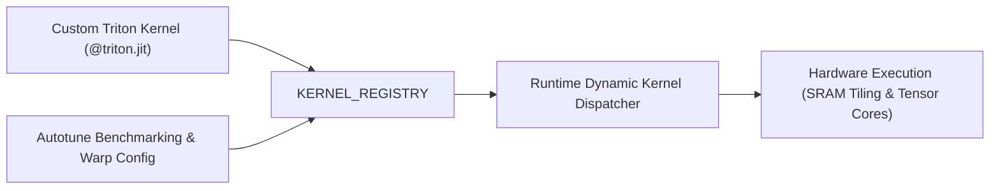

# Custom Triton & CUDA Kernels Engineering Guide

TruthGPT enables engineers to write, benchmark, and dynamically register custom **Triton** and **CUDA** fused kernels directly into the runtime execution pipeline.

---

## 🏛️ Kernel Registration Architecture



---

## ⚡ Triton Fused RMSNorm & SwiGLU Example

Writing fused Triton kernels avoids intermediate GPU HBM round-trips:

```python
import triton
import triton.language as tl
import torch

@triton.jit
def _fused_rmsnorm_kernel(
    X_ptr, Y_ptr, W_ptr,
    stride, N, eps,
    BLOCK_SIZE: tl.constexpr
):
    row_idx = tl.program_id(0)
    row_start = X_ptr + row_idx * stride
    
    # Load row into SRAM
    cols = tl.arange(0, BLOCK_SIZE)
    mask = cols < N
    x = tl.load(row_start + cols, mask=mask, other=0.0).to(tl.float32)
    
    # Calculate Root Mean Square
    variance = tl.sum(x * x, axis=0) / N
    rsqrt = 1.0 / tl.sqrt(variance + eps)
    
    # Scale with learned weight
    w = tl.load(W_ptr + cols, mask=mask, other=1.0).to(tl.float32)
    y = (x * rsqrt) * w
    
    # Store back to global memory
    tl.store(Y_ptr + row_idx * stride + cols, y, mask=mask)
```

---

## 🚀 Registering Kernels in TruthGPT

```python
from registries.unified_registry import KERNEL_REGISTRY

@KERNEL_REGISTRY.register("triton_fused_rmsnorm")
class TritonRMSNormWrapper:
    def __init__(self, d_model: int, eps: float = 1e-6):
        self.d_model = d_model
        self.eps = eps
        self.weight = torch.nn.Parameter(torch.ones(d_model))

    def __call__(self, x: torch.Tensor) -> torch.Tensor:
        y = torch.empty_like(x)
        M, N = x.shape[0] * x.shape[1], x.shape[2]
        BLOCK_SIZE = triton.next_power_of_2(N)
        
        _fused_rmsnorm_kernel[(M,)](
            x, y, self.weight,
            x.stride(1), N, self.eps,
            BLOCK_SIZE=BLOCK_SIZE
        )
        return y
```
