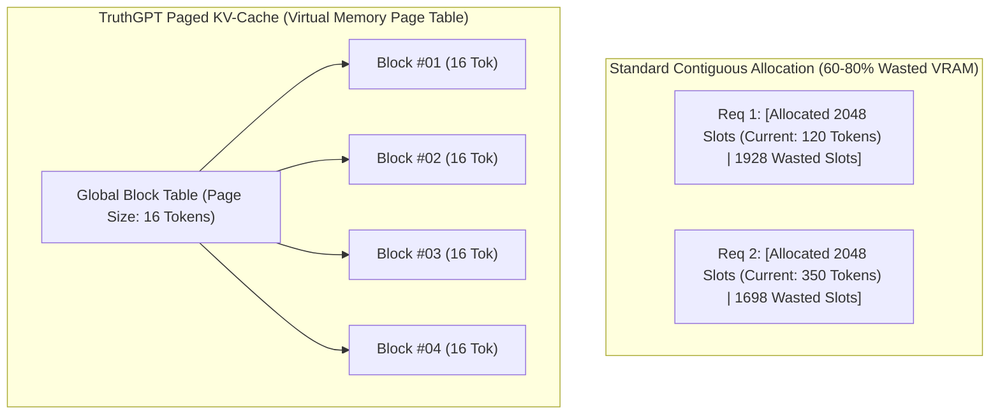

# KV-Cache Acceleration & Management

In LLM autoregressive token generation, storing Key and Value states across thousands of context tokens represents the primary consumer of GPU VRAM. TruthGPT integrates **Paged KV-Cache**, **Chunked Prefill**, and **Quantized KV-Cache (FP8 / INT8)** to maximize concurrency and throughput.

---

## 💾 The Memory Fragmentation Problem vs Paged KV-Cache

Standard KV-Cache allocation reserves contiguous virtual GPU memory blocks for maximum potential sequence lengths. This leads to **internal fragmentation** (reserved memory unused) and **external fragmentation** (unusable gaps between allocations).



---

## ⚡ Quantized KV-Cache (INT8 & FP8)

To serve long context windows (32K - 128K tokens) with minimal VRAM:

| KV Precision | Memory per Token/Layer | Max Concurrent Requests (24GB VRAM) | Perplexity Impact |
| :--- | :--- | :--- | :--- |
| **FP16 / BF16** | 128 bytes | ~32 requests | 0% (Baseline) |
| **FP8 (E4M3)** | 64 bytes | ~64 requests (2x) | < 0.05% |
| **INT8 Per-Head** | 64 bytes | ~64 requests (2x) | < 0.08% |
| **INT4 Quantized** | 32 bytes | ~128 requests (4x) | < 0.25% |

---

## 💻 Python Usage Example

```python
from inference.kv_cache import PagedKVCacheManager, CacheConfig

# Configure Paged KV Cache with FP8 compression
cache_config = CacheConfig(
    block_size=16,
    num_gpu_blocks=4096,
    dtype="fp8",
    max_context_len=8192
)

cache_manager = PagedKVCacheManager(config=cache_config)

# Allocate memory blocks dynamically during token streaming
sequence_id = "req_1001"
cache_manager.allocate(sequence_id, prompt_tokens_len=512)
```
