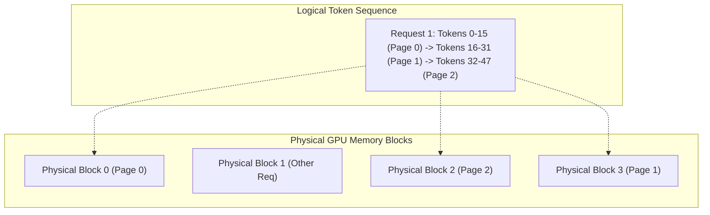

# KV-Cache Acceleration & Management

In LLM autoregressive inference, generating tokens requires attending to the Key and Value states of all previous tokens. Storing these tensors in naive contiguous buffers leads to severe memory fragmentation, high latency, and early out-of-memory errors under concurrent workloads.

TruthGPT integrates **Paged KV-Cache**, **Chunked Prefill**, and **Quantized KV-Cache (FP8 / INT8)** (`optimizers/kv_cache/`).

---

## 🧠 The Memory Fragmentation Problem vs Paged KV-Cache

In traditional systems, memory for maximum sequence length (e.g. 4096 tokens) must be pre-allocated contiguously for each request. If a request terminates after 200 tokens, 95% of allocated memory is trapped in internal fragmentation.

**Paged KV-Cache** models GPU memory after OS Virtual Memory Paging:



- Keys and Values are stored in fixed-size blocks (e.g. 16 or 32 tokens).
- Physical blocks are allocated on-demand as new tokens are generated.
- When a request finishes, blocks are returned to the free list instantaneously without memory copying.

---

## ⚡ Quantized KV-Cache (FP8 / INT8)

By quantizing cached Key/Value vectors from FP16 (16 bits) to FP8 (8 bits) or INT8 with per-channel scale factors, TruthGPT achieves:
- **50%–75% reduction in KV-cache VRAM consumption**.
- **2x–3x increase in maximum concurrent request batch size**.
- Zero perceptible drop in generation perplexity for modern foundation models.

```yaml
inference:
  kv_cache:
    backend: "paged"
    block_size: 16
    quantization: "fp8"          # fp8 | int8 | none
    max_num_seqs: 64
    gpu_memory_utilization: 0.90 # Dedicate 90% free VRAM to KV blocks
```

---

## 🚀 Chunked Prefill & Iteration-Level Scheduling

When long prompt inputs arrive simultaneously with ongoing token generation, prompt computation (prefill) can starve decoding tokens, introducing large latency spikes.

TruthGPT breaks long prefill prompts into smaller chunks (e.g. 512 tokens) and co-schedules prefill chunks alongside decode steps in the same batch iteration. This stabilizes Time-to-First-Token (TTFT) and Inter-Token Latency (ITL).
