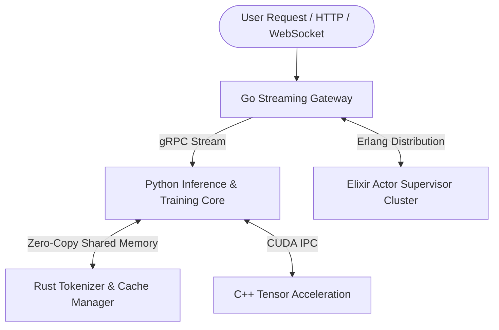

# Distributed Polyglot Bridge & Microservices

The **Polyglot Bridge** connects the core Python optimization engine with **Go** and **Elixir** microservice clusters for distributed concurrency and streaming.

---

## 🌐 Microservice Architecture

---

## 🐹 Go Streaming Gateway (`go_core/`)

- High-performance, concurrent reverse-proxy for serving OpenAI-compatible SSE (Server-Sent Events) and WebSocket token streams.
- Handles tens of thousands of idle connections with negligible memory overhead compared to Python ASGI workers.

---

## 💜 Elixir Actor Supervision (`elixir_core/`)

- Leverages the Erlang BEAM virtual machine's lightweight process model to supervise distributed training workers.
- Automatically handles node heartbeats, failure recovery, and consensus signaling across multi-node clusters.
