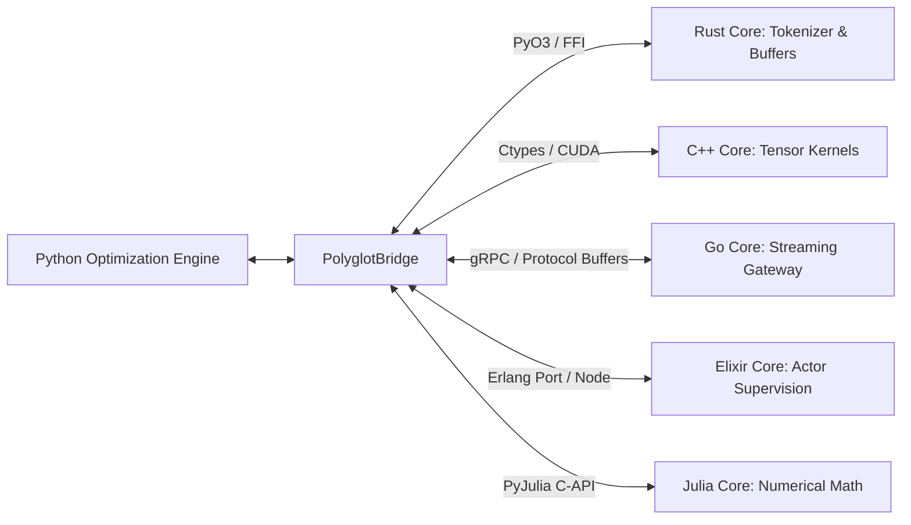

# Polyglot Core Architecture Overview

TruthGPT leverages a **Polyglot Core Architecture** to run performance-critical components in native languages optimized for specific computational and systems domains:

- **C++ (`cpp_core/`)**: Low-level CUDA tensor operations, SIMD matrix kernels, and pinned host-device memory allocation.
- **Rust (`rust_core/`)**: Memory-safe data loading, lock-free ring buffers, tokenizers, and concurrent state management.
- **Elixir (`elixir_core/`)**: Distributed actor-model concurrency, fault-tolerant worker supervision, and live clustering.
- **Julia (`julia_core/`)**: High-precision mathematical modeling, continuous ODE solvers, and scientific computing.
- **Go (`go_core/`)**: High-concurrency gRPC microservice gateways, streaming APIs, and cluster load balancing.
- **Scala (`scala_core/`)**: Distributed big data processing, Apache Spark / Flink dataset tokenization pipelines.

---

## 🏗️ Polyglot Subsystem Map

```
optimization_core/
├── polyglot/                   # Python FFI, PyO3/Ctypes bindings, unified wrapper
│   ├── polyglot_bridge.py      # Universal cross-language RPC & dynamic loader
│   ├── attention.py            # Polyglot attention dispatch
│   ├── compression.py          # Native compression utilities
│   ├── data_loader.py          # High-speed data loading bridges
│   ├── kv_cache.py             # Zero-copy memory pool managers
│   └── tokenizer.py            # Parallelized tokenization wrappers
├── cpp_core/                   # C++ / CUDA kernels
├── rust_core/                  # Rust engine
├── elixir_core/                # BEAM distributed cluster engine
├── julia_core/                 # Julia numerical routines
├── go_core/                    # Go streaming microservices
└── scala_core/                 # Scala / JVM distributed pipelines
```

---

## ⚡ Cross-Language Communication



### Shared Memory Zero-Copy Protocol

Data is passed between Python, Rust, and C++ using aligned shared memory pointers (`PyMemoryView` and `uintptr_t`), eliminating the serialization latency typically associated with multi-process systems.
