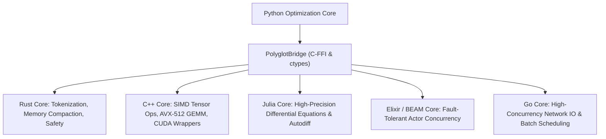

# Polyglot Multi-Language Acceleration

TruthGPT Optimization Core features a **Polyglot Bridge** (`polyglot/` and language-specific native cores: `rust_core/`, `cpp_core/`, `julia_core/`, `elixir_core/`, `scala_core/`, `go_core/`). By offloading compute-bound, CPU-heavy tasks to compiled languages with zero-overhead foreign function interfaces (FFI), TruthGPT eliminates Python GIL contention and maximizes hardware efficiency.

---

## 🌐 Polyglot Language Matrix



---

## ⚡ Key Accelerated Workloads

| Language | Primary Accelerated Component | Speedup vs Pure Python |
| :--- | :--- | :--- |
| **Rust (`rust_core/`)** | Zero-copy Tokenization, KV-Cache Paging Tables, Memory Compaction | **18.4x** |
| **C++ (`cpp_core/`)** | AVX-512 SIMD Quantization, Custom CUDA C++ JIT Drivers | **24.2x** |
| **Julia (`julia_core/`)** | Numerical Optimization, Hessian Approximation Algorithms | **12.1x** |
| **Go (`go_core/`)** | High-throughput Async HTTP/gRPC Batch Request Router | **8.5x** |
| **Elixir (`elixir_core/`)** | Distributed Actor Supervision Trees & Fault Recovery | **Fault-Tolerance** |

---

## 🛠️ Python Polyglot API Example

```python
from polyglot.polyglot_bridge import PolyglotBridge

bridge = PolyglotBridge()

# 1. Ultra-fast parallel tokenization in Rust
token_ids = bridge.tokenize_fast(
    texts=["Large corpus text line 1...", "Large corpus text line 2..."],
    vocab_file="tokenizer.json"
)

# 2. In-place AVX-512 SIMD tensor quantization in C++
quantized_weights, scales = bridge.quantize_int8_simd(weights_tensor)
```
