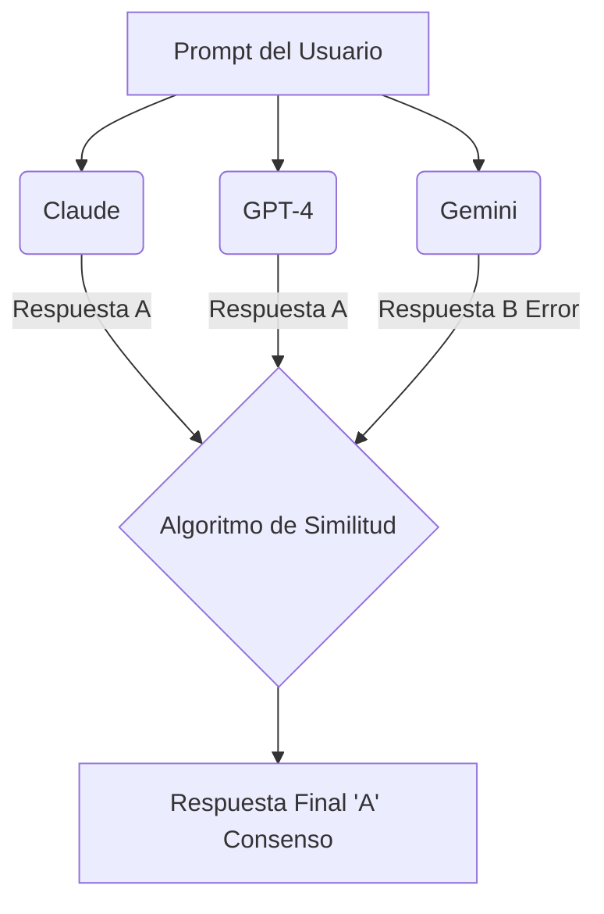
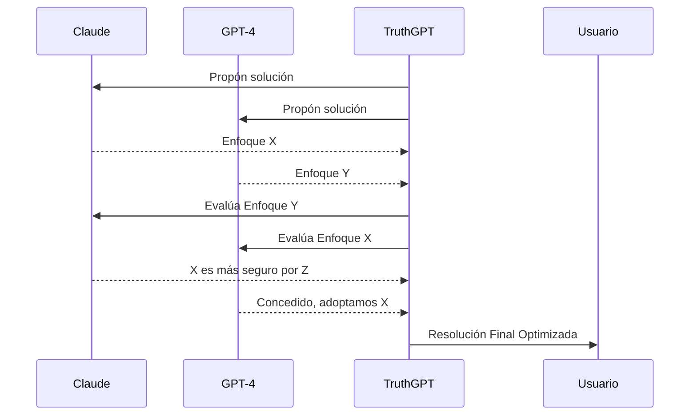

# Ventajas del Modo Ensemble (Swarm) vs Modelo Único en TruthGPT

Este documento detalla las diferencias arquitectónicas y los beneficios prácticos de utilizar un sistema multi-agente (Swarm/Ensemble) frente a la ejecución de un solo modelo (ej. usando solo Claude) en TruthGPT.

## 📊 Tabla Comparativa Rápida

| Característica | Solo Claude (Modelo Único) | Swarm / Ensemble (Claude + 2 Modelos) |
| :--- | :--- | :--- |
| **Precisión Lógica** | Alta | **Máxima (validación cruzada)** |
| **Alucinaciones** | Posibles (no hay filtro externo) | **Casi Nulas (filtradas por consenso)** |
| **Velocidad** | Rápido | Variable (depende de la estrategia) |
| **Costos de API** | Bajo (1x) | Medio/Alto (3x) |
| **Diversidad de Enfoque** | Única (Sesgo del modelo) | **Múltiple (Diferentes arquitecturas)** |
| **Tolerancia a Fallos** | Nula (Si Claude cae, falla) | **Alta (Redundancia de APIs)** |

---

## 1. Ejecución con un Solo Modelo (Modo Base)

En el modo base, TruthGPT envía la petición a un único modelo (por ejemplo, Claude) y procesa su respuesta.

> [!TIP]
> **¿Cuándo usarlo?** Tareas repetitivas, borradores iniciales o cuando el presupuesto de tokens de API es estricto.

### Ventajas y Desventajas
*   ✅ **Velocidad:** Al procesar solo una petición, la latencia depende exclusivamente del tiempo de respuesta de la API de ese modelo específico.
*   ✅ **Eficiencia de Costos:** Se consumen menos tokens.
*   ❌ **Punto Único de Fallo:** Estás limitado a los sesgos y capacidades de un solo modelo.
*   ❌ **Riesgo de Alucinación:** Si el modelo genera información falsa, inventa datos o comete un error de razonamiento lógico, no hay un sistema de validación externo que lo detecte.

---

## 2. Ejecución con Múltiples Modelos (Modo Ensemble / Swarm)

Al usar un conjunto de modelos (ej. Claude + GPT-4 + Gemini), TruthGPT no solo recopila respuestas, sino que activa algoritmos avanzados de reconciliación.

> [!IMPORTANT]
> **El núcleo de TruthGPT:** El Ensemble representa el verdadero valor de TruthGPT para la búsqueda sistemática de la "verdad" y la optimización absoluta de código.

### 🚀 Estrategias Clave y Beneficios

#### A. Estrategia de Consenso/Mayoría (Reducción Drástica de Alucinaciones)
Los modelos generan respuestas independientes. Un algoritmo evalúa matemáticamente la similitud entre ellas.

*   **El Beneficio:** Si un modelo "alucina", pero los otros dos modelos llegan a la misma conclusión correcta, la respuesta errónea se descarta automáticamente. Vital para código de producción y datos matemáticos.

#### B. Estrategia de Debate (Resolución Profunda)
Si las respuestas de los modelos son divergentes, TruthGPT activa un debate interno.

*   **El Beneficio:** Simula a expertos de distintas disciplinas debatiendo el mejor enfoque arquitectónico antes de entregarte la solución.

#### C. Estrategia de Carrera / Race (Reducción de Latencia)
Se envía la petición a múltiples modelos simultáneamente y TruthGPT toma la primera respuesta que llegue completa.
*   **El Beneficio:** Compensa las caídas de servicio o picos de latencia en las APIs. Si un modelo está saturado, TruthGPT no se cuelga.

#### D. Ponderación Bayesiana y Confianza
TruthGPT extrae el nivel de confianza interno de la respuesta de cada modelo y le asigna un "peso" probabilístico.
*   **El Beneficio:** Filtra respuestas vagas y le da prioridad al modelo que demuestre mayor certeza y fundamentación paso a paso.

#### E. Diversidad Cognitiva
Cada modelo está entrenado de forma distinta. Claude puede ser superior en lógica de código, GPT-4 en razonamiento general y Gemini en ventanas de contexto inmensas.
*   **El Beneficio:** El Ensemble une "lo mejor de ambos mundos", ofreciendo una respuesta final libre de los puntos ciegos de un solo proveedor de IA.

---

> [!WARNING]
> **Consideraciones de Costo:** Multiplica el consumo de tokens de API (3x). Úsalo cuando **un error sea inaceptable** en el resultado.
