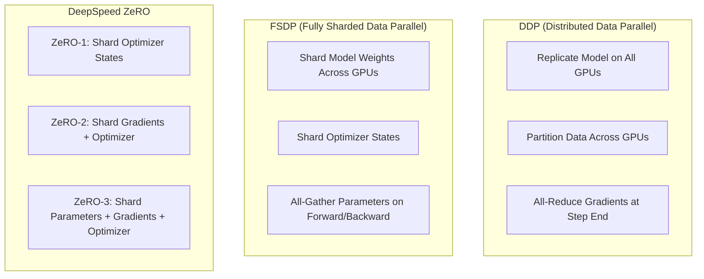

# Distributed Training Guide

The **TruthGPT Distributed Subsystem** (`trainers/dist_manager.py`) manages multi-GPU and multi-node execution across **DDP (Distributed Data Parallel)**, **FSDP (Fully Sharded Data Parallel)**, and **DeepSpeed ZeRO Stages 1, 2, and 3**.

---

## 🚀 Distributed Paradigms Overview



---

## 🛠️ Launching Distributed Jobs

### 1. PyTorch `torchrun` (Recommended)

```bash
# Single node with 8 GPUs
torchrun --nproc_per_node=8 train_llm.py \
    --config configs/presets/performance_max.yaml

# Multi-node training (e.g. 2 nodes with 8 GPUs each)
torchrun \
    --nnodes=2 \
    --nproc_per_node=8 \
    --rdzv_id=truthgpt_job_101 \
    --rdzv_backend=c10d \
    --rdzv_endpoint=192.168.1.10:29500 \
    train_llm.py --config configs/presets/multi_node_fsdp.yaml
```

---

## ⚙️ FSDP Configuration in YAML

To enable PyTorch FSDP in your training YAML:

```yaml
distributed:
  backend: "fsdp"                 # ddp, fsdp, deepspeed
  sharding_strategy: "full_shard" # full_shard, shard_grad_op, no_shard, hybrid_shard
  mixed_precision: "bf16"
  backward_prefetch: "backward_pre"
  forward_prefetch: true
  limit_all_gathers: true
  cpu_offload: false              # Set true if model exceeds total GPU VRAM
```

---

## ⚡ Distributed Memory Comparison

| Strategy | Model Weights VRAM | Optimizer States VRAM | Gradient VRAM | Communication Overhead |
| :--- | :--- | :--- | :--- | :--- |
| **Standard DDP** | 100% per GPU | 100% per GPU | 100% per GPU | Low (All-Reduce gradients) |
| **ZeRO-1 / FSDP Grad** | 100% per GPU | $1/N$ per GPU | 100% per GPU | Low |
| **ZeRO-2** | 100% per GPU | $1/N$ per GPU | $1/N$ per GPU | Low |
| **ZeRO-3 / Full FSDP** | $1/N$ per GPU | $1/N$ per GPU | $1/N$ per GPU | Medium (All-Gather weights on forward/backward) |

*(Where $N$ is the number of GPUs in the distributed world).*
