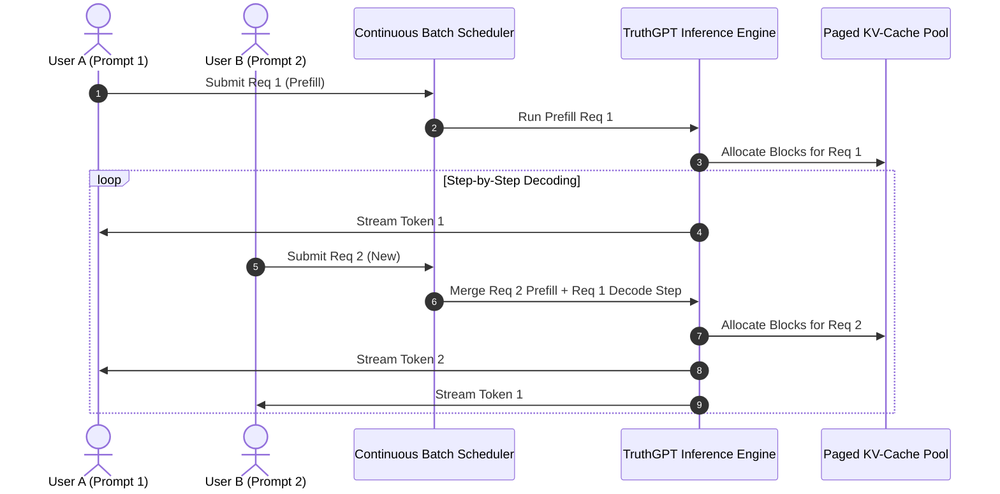

# 🚀 Tutorial: High-Throughput Serving with Paged KV-Cache & Continuous Batching

In this tutorial, you will build and launch an **OpenAI-compatible, production-grade inference server** capable of processing 100+ concurrent user streams using **Continuous Batching**, **Paged KV-Cache**, and **Speculative Decoding**.

---

## 🎯 What You Will Learn
1. The architectural mechanics of **Continuous Batching** (iteration-level scheduling).
2. How to configure and launch the TruthGPT inference engine.
3. How to build an asynchronous, streaming Server-Sent Events (SSE) FastAPI endpoint.
4. How to benchmark throughput (tokens/sec) and latency percentiles (P50, P95, P99) under high concurrent load.

---

## 🏛️ Continuous Batching Architecture

Traditional batching waits for all requests in a batch to finish generation before accepting new requests. **Continuous Batching** (iteration-level scheduling) inserts incoming requests into the active batch immediately at each decoding step:



---

## ⚙️ Step 1: Create Serving Configuration

Save the following configuration as `configs/serving_production.yaml`:

```yaml
engine:
  model_path: "meta-llama/Llama-3-8B-Instruct"
  device: "cuda:0"
  dtype: "bfloat16"
  gpu_memory_utilization: 0.92   # Allocate 92% of VRAM to weights + KV cache

paged_kv_cache:
  enabled: true
  block_size: 16                # 16 tokens per block
  max_num_blocks: 4096
  quantization: "fp8"           # FP8 KV cache compression

scheduler:
  max_batch_size: 128
  max_waiting_tokens: 512
  priority_policy: "shortest_remaining_time_first"
```

---

## 🐍 Step 2: Build FastAPI Inference Microservice

Create `inference/fastapi_server.py`:

```python
import asyncio
import json
from typing import AsyncGenerator
from fastapi import FastAPI, HTTPException
from fastapi.responses import StreamingResponse
from pydantic import BaseModel

from inference import create_inference_engine, EngineType
from inference.middleware.cache_manager import CacheManager

app = FastAPI(title="TruthGPT High-Throughput Serving API", version="2.0.0")

# Initialize shared global inference engine
engine = create_inference_engine(
    model="meta-llama/Llama-3-8B-Instruct",
    engine_type=EngineType.AUTO_FALLBACK,
    prefer_gpu=True
)

class ChatMessage(BaseModel):
    role: str
    content: str

class ChatCompletionRequest(BaseModel):
    model: str = "meta-llama/Llama-3-8B-Instruct"
    messages: list[ChatMessage]
    max_tokens: int = 256
    temperature: float = 0.7
    stream: bool = False

@app.post("/v1/chat/completions")
async def chat_completions(req: ChatCompletionRequest):
    prompt = "\n".join([f"{m.role}: {m.content}" for m in req.messages]) + "\nassistant: "
    output = engine.generate(prompt=prompt, max_new_tokens=req.max_tokens)
    return {
        "model": req.model,
        "choices": [{"message": {"role": "assistant", "content": output}, "finish_reason": "stop"}]
    }
```

---

## 📊 Step 3: Benchmarking Throughput and Latency

Run the inference benchmark suite to measure tokens-per-second throughput under continuous concurrency:

```bash
python -m benchmarks.benchmark_inference --concurrency 64 --prompts 500
```
