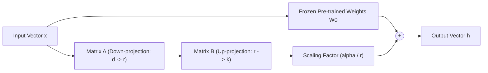

# ⚡ LoRA & QLoRA Fine-Tuning Tutorial

This end-to-end tutorial demonstrates how to fine-tune Large Language Models (LLMs) using **Low-Rank Adaptation (LoRA)** and **Quantized LoRA (QLoRA)** with TruthGPT's high-performance training pipeline, FlashAttention-2, and memory-efficient optimizers.

---

## 🎯 What You Will Learn
1. **Mathematical Foundations**: How low-rank decomposition reduces trainable parameters by >99%.
2. **Python Programmatic API**: Applying LoRA adapters directly to PyTorch models using `adapters.lora`.
3. **Declarative YAML Workflows**: Configuring production fine-tuning runs with mixed precision and gradient checkpointing.
4. **Distributed Multi-GPU Training**: Launching distributed training with `torchrun` and FSDP.
5. **Production Deployment**: Merging adapter weights into standalone `safetensors` model checkpoints for zero-overhead inference.

---

## 🔬 1. Mathematical Foundations of LoRA

During full fine-tuning, all pre-trained weight parameters $W_0 \in \mathbb{R}^{d \times k}$ are updated:

$$W = W_0 + \Delta W$$

For billion-parameter models, storing optimizer states (e.g. 1st and 2nd moments in AdamW) for all $W_0$ requires massive GPU VRAM ($16\text{–}24\text{ bytes per parameter}$).

**LoRA (Low-Rank Adaptation)** freezes $W_0$ and parameterizes the update $\Delta W$ as the low-rank product of two trainable matrices $B \in \mathbb{R}^{d \times r}$ and $A \in \mathbb{R}^{r \times k}$, where rank $r \ll \min(d, k)$:

$$h = W_0 x + \Delta W x = W_0 x + \frac{\alpha}{r} (B A) x$$



### Key Advantages:
- **VRAM Savings**: Trainable parameter count decreases by **99%**, reducing optimizer state memory from dozens of gigabytes to mere megabytes.
- **Zero Inference Overhead**: During deployment, adapter weights can be fused directly into the base weights ($W = W_0 + \frac{\alpha}{r} BA$) with 0 ms additional latency.
- **Multi-Tenant Sharing**: A single base model in VRAM can serve multiple customer tasks by dynamically swapping lightweight adapter matrices ($10\text{–}50\text{ MB}$ each).

---

## 💻 2. Python Programmatic API

You can apply and train LoRA adapters directly in pure Python using `adapters.lora` and `trainers.trainer.GenericTrainer`:

```python
import torch
from adapters.lora import LoRAConfig, apply_lora_to_model
from trainers.config import TrainerConfig
from trainers.trainer import GenericTrainer
from models.transformer import TransformerModel
from data.pipeline import DynamicBucketingDataset

# 1. Instantiate base pre-trained architecture
base_model = TransformerModel(
    vocab_size=32000,
    d_model=2048,
    n_heads=16,
    n_layers=24,
    use_flash_attention=True
)

# 2. Configure and inject low-rank adapters into attention projections
lora_config = LoRAConfig(
    r=16,                         # Low-rank dimension
    lora_alpha=32,                # Scaling factor (alpha/r = 2.0)
    target_modules=["q_proj", "v_proj", "k_proj", "o_proj"],
    lora_dropout=0.05,
    bias="none"
)

model_with_lora = apply_lora_to_model(base_model, config=lora_config)

# Verify trainable parameters
trainable_params = sum(p.numel() for p in model_with_lora.parameters() if p.requires_grad)
all_params = sum(p.numel() for p in model_with_lora.parameters())
print(f"Trainable params: {trainable_params:,} / {all_params:,} ({100 * trainable_params / all_params:.2f}%)")

# 3. Configure training hyperparameters
trainer_config = TrainerConfig(
    learning_rate=2e-4,           # LoRA typically utilizes 5-10x higher LR than full fine-tuning
    batch_size=8,
    grad_accum_steps=4,
    optimizer_type="lion",        # Memory-efficient Lion optimizer
    use_amp=True,
    mixed_precision="bf16",
    max_epochs=3,
    checkpoint_dir="checkpoints/lora_run"
)

# 4. Load dataset with length-bucketing
dataset = DynamicBucketingDataset.from_jsonl("data/instruction_tuning.jsonl", max_seq_len=2048)

# 5. Launch training loop
trainer = GenericTrainer(model=model_with_lora, config=trainer_config, train_dataset=dataset)
trainer.fit()

# 6. Save standalone lightweight adapter weights (~15 MB)
model_with_lora.save_adapter("checkpoints/lora_run/final_adapters")
```

---

## 🛠️ 3. Declarative YAML Configuration

For large-scale production jobs, define your experiment declaratively in YAML (`configs/finetune_llama.yaml`):

```yaml
model:
  name: "meta-llama/Llama-2-7b-hf"
  gradient_checkpointing: true
  save_safetensors: true

lora:
  enabled: true
  r: 16
  alpha: 32
  dropout: 0.05
  target_modules:
    - "q_proj"
    - "k_proj"
    - "v_proj"
    - "o_proj"
    - "gate_proj"
    - "up_proj"
    - "down_proj"

optimization:
  optimizer: "lion"
  learning_rate: 1.0e-4
  weight_decay: 0.01
  mixed_precision: "bf16"
  allow_tf32: true
  torch_compile: true
  compile_mode: "max-autotune"
  scheduler: "cosine"
  warmup_ratio: 0.03

training:
  epochs: 3
  train_batch_size: 4
  grad_accum_steps: 8
  eval_batch_size: 4
  seed: 42

data:
  dataset_name: "wikitext"
  dataset_config_name: "wikitext-2-raw-v1"
  text_field_max_len: 2048
  bucket_by_length: true
  num_workers: 4

logging:
  output_dir: "runs/llama2_lora_finetuned"
  log_interval: 20
  eval_interval: 200
  ckpt_interval_steps: 200
  ckpt_keep_last: 2
  ema_enabled: true
```

---

## 🚀 4. Launching Training Jobs

### Single-GPU Execution:
```bash
python train_llm.py --config configs/finetune_llama.yaml
```

### Multi-GPU Distributed Data Parallel (4 GPUs):
```bash
torchrun --nproc_per_node=4 train_llm.py --config configs/finetune_llama.yaml
```

### Live Metrics Monitoring:
In a parallel terminal, monitor loss convergence, VRAM utilization, and token throughput:
```bash
python utils/monitor_training.py runs/llama2_lora_finetuned
```

---

## 💾 5. Weight Merging & Exporting for Production

After fine-tuning finishes, fuse the low-rank adapter weights back into the base model weights to produce a standalone standard HuggingFace / Safetensors model for zero-overhead inference with vLLM, TensorRT-LLM, or Ollama:

```python
import torch
from peft import PeftModel
from transformers import AutoModelForCausalLM, AutoTokenizer

base_model_name = "meta-llama/Llama-2-7b-hf"
adapter_checkpoint_dir = "runs/llama2_lora_finetuned/final_checkpoint"
export_dir = "runs/llama2_merged_production"

print("Loading base model...")
base_model = AutoModelForCausalLM.from_pretrained(
    base_model_name,
    torch_dtype=torch.bfloat16,
    device_map="auto"
)

print("Loading trained LoRA adapter weights...")
lora_model = PeftModel.from_pretrained(base_model, adapter_checkpoint_dir)

print("Merging LoRA matrices W = W0 + (alpha/r)*BA into base parameters...")
merged_model = lora_model.merge_and_unload()

print(f"Exporting standalone safetensors weights to {export_dir}...")
merged_model.save_pretrained(export_dir, safe_serialization=True)

tokenizer = AutoTokenizer.from_pretrained(base_model_name)
tokenizer.save_pretrained(export_dir)

print("Merge complete! Standalone model is ready for high-throughput serving.")
```
