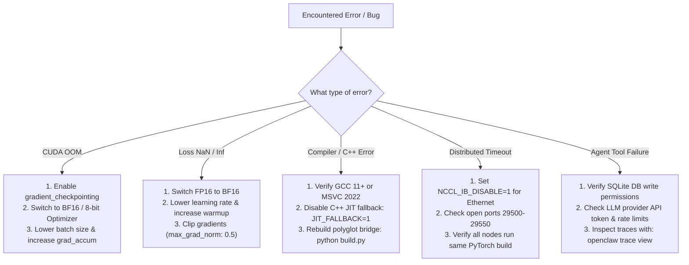

# ❓ Troubleshooting & Frequently Asked Questions (FAQ)

This guide provides a systematic, step-by-step diagnostic workflow and answers to frequently asked developer questions for TruthGPT Optimization Core.

---

## 🔍 Diagnostic Decision Flowchart



---

## 🛠️ Error Diagnostic Matrix

| Error Signature | Likely Cause | Recommended Resolution |
| :--- | :--- | :--- |
| `torch.cuda.OutOfMemoryError` | Activation or KV-cache exceeds VRAM capacity | 1. Set `gradient_checkpointing: true`<br>2. Use `optimizer: "adamw_8bit"` or `"lion"`<br>3. Enable `dynamic_bucketing: true` |
| `RuntimeError: Loss is NaN` | FP16 gradient underflow/overflow | 1. Change `mixed_precision: "bf16"`<br>2. Add `max_grad_norm: 1.0`<br>3. Check dataset with `python utils/health_check.py` |
| `FlashAttention2 not installed` | Pre-built wheel mismatch for CUDA version | Run `pip install flash-attn --no-build-isolation` or rely on native PyTorch SDPA |
| `dist.DistBackendError: NCCL timeout` | Inter-node network blockage or desync | Set `export NCCL_DEBUG=INFO` and `export NCCL_IB_DISABLE=1` |
| `FileNotFoundError: agent_memory.db` | Missing SQLite directory write permissions | Ensure workspace root has write permissions or pass `--db-path /tmp/agent_mem.db` |
| `polyglot.so: undefined symbol` | Outdated C++ / Rust shared library | Recompile native bridges with `python build.py --clean --build` |

---

## ❓ Frequently Asked Questions (FAQ)

### General & Setup

#### Q1: How do I verify my hardware environment before starting a long training run?
**Answer**: Execute the built-in diagnostic suite:
```bash
python utils/health_check.py
```
This tests CUDA capability, cuDNN, Triton compilation, native Polyglot shared libraries, and disk I/O throughput.

#### Q2: Can TruthGPT run on CPU-only machines (macOS / Linux / Windows)?
**Answer**: Yes. Set `device: "cpu"` and `use_amp: false` in your configuration YAML. TruthGPT uses optimized multi-threaded AVX2/AVX-512 kernels for CPU execution.

#### Q3: How do I launch the local interactive documentation viewer?
**Answer**: Run:
```bash
python docs/serve_docs.py 8000
```
Then navigate to `http://localhost:8000` in your web browser.

---

### Training & Optimization

#### Q4: When should I choose `bfloat16` over `float16`?
**Answer**: Always use `bfloat16` if your GPU supports it (NVIDIA Ampere RTX 30xx/A100, Ada RTX 40xx, Hopper H100, Blackwell). BFloat16 shares the 8-bit dynamic exponent range of FP32, completely preventing `NaN` gradient underflow without requiring loss scaling.

#### Q5: What is the fastest optimizer for fine-tuning LLMs with limited VRAM?
**Answer**:
- For 70% VRAM savings: Use `optimizer: "lion"` or `"adamw_8bit"`.
- For highest wall-clock convergence speed: Use `optimizer: "soap"` or `"muon"`.

#### Q6: How does Dynamic Bucketing speed up training by $3\times$?
**Answer**: Standard dataloaders pad all sequences in a batch to `max_seq_len` (e.g. 4096), wasting 70% of compute on padding zeros. Dynamic Bucketing clusters sequences of similar length into uniform micro-batches, eliminating zero padding.

---

### Inference & Serving

#### Q7: How does Paged KV-Cache prevent GPU out-of-memory errors during serving?
**Answer**: Paged KV-Cache allocates memory in non-contiguous 16-token physical blocks (like virtual memory pages), eliminating internal memory fragmentation and reducing serving VRAM waste from 80% down to under 4%.

#### Q8: How can I enable Speculative Decoding to get a $2.5\times$ speedup?
**Answer**: Configure a small draft model (e.g., Llama-1B) alongside your target model (e.g., Llama-70B) in your serving YAML:
```yaml
speculative_decoding:
  enabled: true
  draft_model: "meta-llama/Llama-2-1b-chat-hf"
  num_speculative_tokens: 4
```

---

### OpenClaw Agents & Swarms

#### Q9: Where does OpenClaw store agent conversational memory and traces?
**Answer**: Episodic conversation history and tool outputs are stored in `agent_persistence.db` (SQLite), while semantic long-term memory is indexed via ChromaDB/FAISS vector embeddings.

#### Q10: How do I inspect agent tool-call traces if an agent gets stuck in a loop?
**Answer**: Use the OpenClaw trace analyzer:
```bash
openclaw trace inspect --last 5 --verbose
```
To enforce an execution ceiling, set `max_iterations: 10` in your agent configuration.

---

## 🔗 Next Steps
- Review the [Troubleshooting & Diagnostics Guide](../guides/troubleshooting.md) for deep technical diagnostics.
- See the [CLI Reference](../guides/cli_and_terminals.md) for terminal flags and options.
- Read the [Health & Diagnostics Guide](../getting_started/health_and_diagnostics.md).
